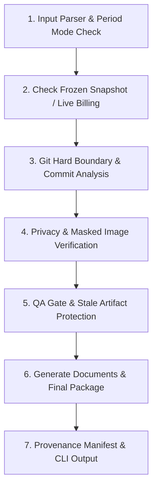

# SIASEK BOSP Evidence Package Generator (`/siasek-bos`)

Skill ini digunakan untuk membuat **Paket Dokumen Pendukung BOSP** untuk layanan **Aplikasi Presensi SIASEK** (SMP Negeri 1 Biau).

> [!IMPORTANT]
> - Skill ini menghasilkan **PAKET BUKTI PENYEDIA / LAYANAN** untuk mendukung LPJ BOSP sekolah.
> - **JANGAN** menyebut paket ini sebagai *"LPJ BOSP final milik sekolah"*.
> - **JANGAN** membuat bukti pembayaran. Bukti pembayaran dilampirkan oleh pihak sekolah.

---

## 1. Konsep Utama Keamanan & Pembekuan Tagihan (Billing Provenance & Safety)

1. **Live Billing Snapshot (Bulan Berjalan)**:
   Pada bulan berjalan (`CURRENT_PERIOD`), jumlah siswa aktif diambil dari UI Aplikasi LIVE SIASEK via Admin Browser Extractor (`/admin/dashboard`).
2. **Frozen Verified Snapshot**:
   Ketika billing dinyatakan `VERIFIED` dan lulus `QA PASS`, hasilnya dibekukan ke `evidence/bosp/<YYYY>/<MM>-<bulan>/billing/billing-snapshot.json`.
3. **Historical Period Reuse**:
   Untuk bulan yang telah berlalu (`HISTORICAL_PERIOD`), generator wajib mengulang penggunaan **Frozen Verified Snapshot** yang ada pada direktori target. Generator dilarang mengambil data LIVE masa kini untuk menggantikan data historis.
4. **Blocked & Stale Artifact Safety**:
   Jika QA bernilai `BLOCKED`, generator secara otomatis mengarantina berkas usang di `blocked/previous-invalid-artifacts/` dan membuat `BLOCKED_REPORT_<BULAN>_<TAHUN>.md`.

---

## 2. Alur Eksekusi Automated Workflow

Saat perintah `/siasek-bos bulan <bulan> <tahun>` dipanggil (misal: `/siasek-bos bulan september 2026`):



---

## 3. Langkah-Langkah Eksekusi Skill

### Langkah 1: Run Automation Script
Jalankan helper script penyusun paket bukti BOSP dari root repositori:

```bash
php .agents/skills/siasek-bos/scripts/generate_bosp_package.php --month=<bulan> --year=<tahun>
```

### Langkah 2: Evaluasi Output & QA Status
- **Current Period**: Mengambil data LIVE, menyimpan `billing-snapshot.json` jika verified.
- **Historical Period**: Menggunakan `billing-snapshot.json` yang dibekukan. Jika tidak ada snapshot terverifikasi, QA status = `BLOCKED`.

---

## 4. Struktur Paket Output

Hasil eksekusi disimpan pada direktori: `evidence/bosp/<YYYY>/<MM>-<bulan>/`

```text
evidence/bosp/2026/09-september/
├── 01_invoice/
│   └── INVOICE_SIASEK_BIAU_SEPTEMBER_2026.pdf
├── 02_rincian_pemanfaatan/
│   └── RINCIAN_PEMANFAATAN_SIASEK_BIAU_SEPTEMBER_2026.pdf
├── 03_pembaruan_fitur/
│   └── PEMBARUAN_FITUR_SIASEK_BIAU_SEPTEMBER_2026.pdf
├── 04_screenshots/
│   ├── bukti_billing_september_2026.png
│   └── bukti_admin_leave_intervention_september_2026.png
├── 05_evidence_index/
│   └── EVIDENCE_INDEX_SIASEK_BIAU_SEPTEMBER_2026.pdf
├── billing/
│   ├── billing-snapshot.json
│   └── snapshots/
│       └── 2026-09-27.json
├── FINAL/
│   └── PAKET_BOSP_SIASEK_BIAU_SEPTEMBER_2026.pdf
└── manifest.json
```

---

## 5. Format Laporan Akhir CLI Output

```text
SNAPSHOT CREATED:
YES/NO

SNAPSHOT FILE:
...

STUDENT COUNT:
...

SNAPSHOT DATE:
...

FROZEN:
YES/NO

HISTORICAL REUSE:
PASS/FAIL

STALE ARTIFACT PROTECTION:
PASS/FAIL

AUGUST:
...

SEPTEMBER:
...

QA:
PASS/BLOCKED
```

