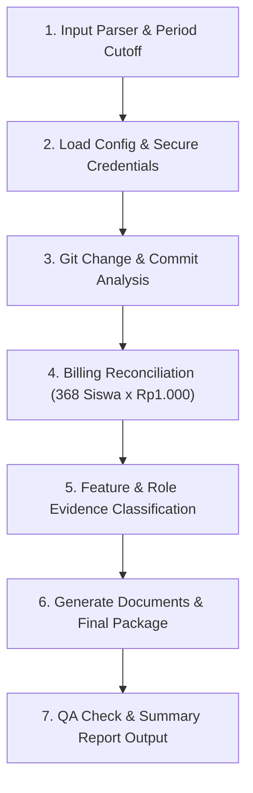

# SIASEK BOSP Evidence Package Generator (`/siasek-bos`)

Skill ini digunakan untuk membuat **Paket Dokumen Pendukung BOSP** untuk layanan **Aplikasi Presensi SIASEK** (SMP Negeri 1 Biau).

> [!IMPORTANT]
> - Skill ini menghasilkan **PAKET BUKTI PENYEDIA / LAYANAN** untuk mendukung LPJ BOSP sekolah.
> - **JANGAN** menyebut paket ini sebagai *"LPJ BOSP final milik sekolah"*.
> - **JANGAN** membuat bukti pembayaran. Bukti pembayaran dilampirkan oleh pihak sekolah.

---

## 1. Alur Eksekusi Automated Workflow

Saat perintah `/siasek-bos bulan <bulan> <tahun>` dipanggil (misal: `/siasek-bos bulan september 2026`):



---

## 2. Langkah-Langkah Eksekusi Skill

### Langkah 1: Run Automation Script
Jalankan helper script penyusun paket bukti BOSP dari root repositori:

```bash
php .agents/skills/siasek-bos/scripts/generate_bosp_package.php --month=<bulan> --year=<tahun>
```

### Langkah 2: Evaluasi Output & QA Status
- **Billing Reconciliation Check**: Memastikan data siswa di database (368 siswa) sesuai dengan tarif Rp1.000/siswa/bulan = Rp368.000. Jika terjadi ketidakcocokan data billing, QA status = `BLOCKED`.
- **Git Feature Classification**: Memisahkan secara tegas antara **Fitur Aplikasi SIASEK (Bisnis)** dengan **Infrastruktur Audit / Tooling Evidence**.
- **Live Screenshots Reference**: Menyertakan 4–8 screenshot utama dari folder `docs/BOSP/live-evidence/`.

---

## 3. Struktur Paket Output

Hasil eksekusi akan disimpan pada direktori:
`evidence/bosp/<YYYY>/<MM>-<bulan>/`

```text
evidence/bosp/2026/09-september/
├── 01_invoice/
│   └── INVOICE_SIASEK_september_2026.md
├── 02_rincian_pemanfaatan/
│   └── RINCIAN_PEMANFAATAN_september_2026.md
├── 03_pembaruan_fitur/
│   └── PEMBARUAN_FITUR_september_2026.md
├── 04_screenshots/
│   ├── bukti_01_dashboard.png
│   ├── bukti_08_teacher_dashboard.png
│   ├── bukti_11_parent_dashboard.png
│   ├── bukti_13_satpam_dashboard.png
│   └── bukti_14_kepsek_dashboard.png
├── 05_evidence_index/
│   └── EVIDENCE_INDEX_september_2026.md
├── 06_source_reference/
│   └── GIT_LOG_REFERENCE.txt
├── FINAL/
│   └── PAKET_BOSP_SIASEK_september_2026.md
└── manifest.json
```

---

## 4. Format Laporan Akhir

Setelah eksekusi selesai, tampilkan ringkasan laporan akhir:

```text
==================================================
SIASEK BOSP EVIDENCE GENERATOR
==================================================
PERIODE          : September 2026
EVIDENCE CUTOFF  : YYYY-MM-DD
BILLING RECON    : 368 Siswa x Rp1.000 = Rp368.000 (VERIFIED)
INVOICE NUMBER   : INV-SIASEK/2026/09/001
TOTAL FEATURES   : 4 (1 NEW, 2 UPDATED, 1 ACTIVE)
ROLES VERIFIED   : 5 Roles (Viewer, Principal, Teacher, Parent, Satpam)
SCREENSHOTS      : 5 File LIVE Screenshots Attached
QA STATUS        : PASS
FINAL PACKAGE    : evidence/bosp/2026/09-september/FINAL/PAKET_BOSP_SIASEK_september_2026.md
MANIFEST         : evidence/bosp/2026/09-september/manifest.json
==================================================
```
