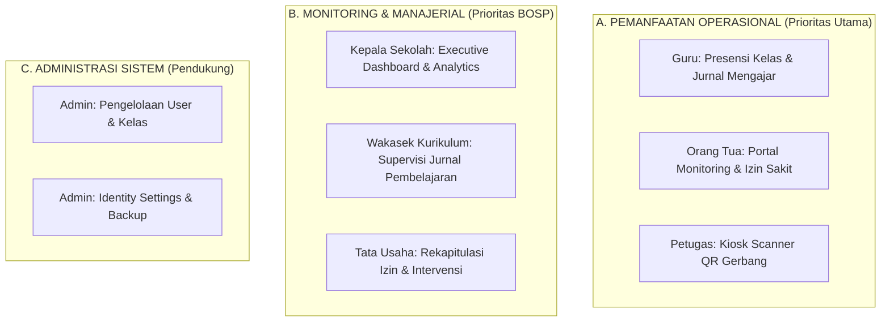

# SIASEK Role & Evidence Matrix — Matriks Peran & Bukti Pemanfaatan Aplikasi

**Tanggal Audit**: 27 September 2026  
**Project Context**: SIASEK (Sistem Informasi & Absensi Sekolah - SMP Negeri 1 Biau)  
**Live Production**: [https://presensi-smpn1biau.zahradev.id](https://presensi-smpn1biau.zahradev.id)  

---

## 1. Actual Roles (Berdasarkan Codebase & Database)

Tabel berikut menyajikan seluruh peran (role) aktual yang teridentifikasi dari tabel `users`, Spatie permission (`roles` / `model_has_roles`), serta route middleware aplikasi:

| ROLE | SOURCE OF TRUTH | USER COUNT LOCAL | MAIN PURPOSE |
| :--- | :--- | :--- | :--- |
| **admin** | `users.role = admin`, Spatie Role `admin`, `AdminMiddleware` | 1 | Administrator Utama & Kelola Konfigurasi Sistem (SIPADA Admin) |
| **teacher** / **guru** | `users.role = teacher/guru`, Spatie `teacher/wali_kelas`, `TeacherMiddleware` | 14 | Pengisian Presensi Mapel, Jurnal Mengajar, Anecdotes, & Wali Kelas |
| **parent** | `users.role = parent`, Spatie Role `parent`, `ParentMiddleware` | 8 | Portal Orang Tua (Monitoring Anak, Pengajuan Izin/Sakit, Verifikasi) |
| **student** | `users.role = student`, Spatie Role `student` | 163 | Identitas Siswa & Presensi QR Code/Kiosk |
| **viewer** | `users.role = viewer`, Spatie Role `viewer`, `CheckRoleMiddleware` | 1 | Akun Audit Evidence Read-Only untuk BOSP & Monitoring Live |
| **operator** | Route Middleware (`role:admin,operator,...`) | 0 (Mapped Admin) | Operasional Harian Sekolah & Rekap Presensi |
| **kepala_sekolah** / **wakasek_kurikulum** | Spatie Role `wakasek_kurikulum`, Route Middleware (`role:...,kepala_sekolah,...`) | 1 | Dashboard Eksekutif, Monitoring Presensi, & Supervisi Jurnal Guru |
| **tu** / **tata_usaha** | Route Middleware (`role:admin,operator,tu,tata_usaha`) | 0 (Mapped Admin) | Input Presensi Manual TU & Pengelolaan Izin Siswa |
| **satpam** / **guru_piket** | Route Middleware, `ScannerAccessMiddleware` | 0 (Mapped Scanner) | Pengoperasian Kiosk Scanner Presensi QR/Face di Gerbang |

---

## 2. Role → Route Mapping

| ROLE | MENU | ROUTE | METHOD | ACCESS | PURPOSE |
| :--- | :--- | :--- | :--- | :--- | :--- |
| **Admin** | System Management | `/admin/settings/*`, `/admin/users/*` | GET, POST, PUT, DELETE | READ / WRITE | Pengelolaan Pengguna & Sistem |
| **Teacher** | Dashboard Guru | `/teacher/dashboard` | GET | READ | Overview Jadwal & Presensi Kelas |
| **Teacher** | Input Presensi Mapel | `/teacher/mark-attendance` | POST | WRITE | Catat Kehadiran Siswa Per Jam Pelajaran |
| **Teacher** | Presensi Ekstrakurikuler | `/teacher/extracurricular-attendance/*` | GET, POST | READ / WRITE | Input/Scan Presensi Kegiatan Ekskul |
| **Teacher** | Jurnal Mengajar | `/teacher/notes/update` | POST | WRITE | Catat Materi & Jurnal Harian Guru |
| **Teacher** | Catatan Anecdotes | `/teacher/anecdotes` | GET, POST, DELETE | READ / WRITE | Catat Perkembangan / Kejadian Siswa |
| **Parent** | Dashboard Orang Tua | `/parent/dashboard` | GET | READ | Ringkasan Kehadiran & Aktivitas Anak |
| **Parent** | Pengajuan Izin | `/parent/leave-requests` | GET, POST | READ / WRITE | Pengajuan Surat Izin / Sakit Siswa |
| **Parent** | API Detail Anak | `/api/parent/students/{id}/*` | GET | READ | Cek Presensi, Jurnal Guru, & Catatan |
| **Kepala Sekolah** | Executive Dashboard | `/principal/dashboard` | GET | READ | Monitor Persentase Kehadiran Sekolah |
| **Wakasek Kurikulum** | Supervisi Jurnal | `/admin/teaching-journals` | GET, POST | READ / WRITE | Verifikasi & Approval Jurnal Guru |
| **TU (Tata Usaha)** | Manajemen Izin | `/admin/leave-requests` | GET, POST, PUT | READ / WRITE | Intervensi & Approval Izin Siswa |
| **Satpam / Piket** | Kiosk Presensi | `/scanner`, `/permit-scanner` | GET, POST | READ / WRITE | Scan Barcode / QR Presensi Gerbang |
| **Viewer** | Monitoring Audit | `/admin/dashboard`, `/principal/dashboard`, `/admin/reports`, `/admin/teaching-journals`, `/admin/leave-requests` | GET | **READ ONLY** | Audit Evidence BOSP & Inspection |

---

## 3. Role → Feature Evidence

### A. Role: Teacher (Guru)
- **Halaman Evidence**: Dashboard Guru (`/teacher/dashboard`), Presensi Mapel (`/teacher/mark-attendance`), Catatan Anecdotes (`/teacher/anecdotes`).
- **Data Terlihat**: Jadwal Mengajar Harian, Daftar Siswa Per Kelas, Form Jurnal Pembelajaran, Status Kehadiran Siswa.
- **Evidence Value**: **Sangat Tinggi** (Bukti Pemanfaatan Utama Operasional Pembelajaran).

### B. Role: Parent (Orang Tua)
- **Halaman Evidence**: Portal Orang Tua (`/parent/dashboard`), Form Pengajuan Izin (`/parent/leave-requests`).
- **Data Terlihat**: Status Kehadiran Realtime Anak, Riwayat Jurnal Guru, Form Upload Surat Dokter/Izin.
- **Evidence Value**: **Sangat Tinggi** (Bukti Akses Publik & Keterlibatan Orang Tua).

### C. Role: Kepala Sekolah / Wakasek Kurikulum
- **Halaman Evidence**: Dashboard Principal (`/principal/dashboard`), Supervisi Jurnal (`/admin/teaching-journals`).
- **Data Terlihat**: Grafik Kehadiran 14 Hari (59.1%), Daftar Jurnal Mengajar Guru Menunggu Verifikasi.
- **Evidence Value**: **Tinggi** (Bukti Pengawasan & Manajerial Sekolah).

### D. Role: Viewer (Auditor Evidence BOSP)
- **Halaman Evidence**: Monitoring Dashboard (`/admin/dashboard`), Rekap Laporan (`/admin/reports`), Analytics (`/admin/reports/charts`).
- **Data Terlihat**: 368 Siswa Aktif, 26 Guru, 10 Jurnal Mengajar, 219 Izin/Sakit.
- **Evidence Value**: **Sangat Tinggi** (Sudah Terverifikasi LIVE).

---

## 4. Pengelompokan 3 Jenis Bukti Pemanfaatan

---

## 5. Identifikasi Role yang Membutuhkan Akun Evidence

| ROLE | PERLU AKUN EVIDENCE? | ALASAN | HALAMAN TARGET |
| :--- | :--- | :--- | :--- |
| **Viewer** | **SUDAH ADA (LIVE)** | Telah dibuktikan login LIVE & mengambil screenshot monitoring | `/admin/dashboard`, `/principal/dashboard`, `/admin/reports` |
| **Guru (Teacher)** | **YA (DISARANKAN)** | Membuktikan UI operasional guru (input presensi mapel, jurnal, & anecdotes) yang tidak dapat dibuka viewer | `/teacher/dashboard`, `/teacher/anecdotes` |
| **Orang Tua (Parent)**| **YA (DISARANKAN)** | Membuktikan UI portal orang tua (monitoring anak & pengajuan izin) yang tidak dapat dibuka viewer | `/parent/dashboard`, `/parent/leave-requests` |
| **Kepala Sekolah** | **TIDAK TERPISAH** | Sudah ter-cover oleh akun `viewer` (akses ke `/principal/dashboard` sudah verified LIVE) | N/A |
| **Admin System** | **TIDAK DIBUTUHKAN** | Area sensitif manajemen user/system, kurang relevan untuk bukti pemanfaatan BOSP | N/A |

---

## 6. Privacy & Safety Notes (Masking Rules)

Bila screenshot dari akun operasional (Guru/Orang Tua) diambil di kemudian hari:
- **Nama Siswa / NIP / NISN**: Perlakukan dengan masking jika dipublikasikan untuk umum.
- **Nomor Telepon / HP**: Wajib di-masking.
- **Surat Dokter / Dokumen Upload**: Wajib di-masking data pribadi medisnya.

---

## 7. Status Keterbuktian Pemanfaatan (Evidence Taxonomy)

- **LIVE OPERATIONAL EVIDENCE** (Sudah Terbukti di Production):
  - Dashboard Admin & Principal (`/admin/dashboard`, `/principal/dashboard`)
  - Laporan & Analytics Presensi (`/admin/reports`, `/admin/reports/charts`)
  - Supervisi Jurnal Mengajar (`/admin/teaching-journals`)
  - Rekap Request Izin/Sakit (`/admin/leave-requests`)
  - Verifikasi Klaim Orang Tua (`/admin/parent-verifications`)

- **FEATURE ACCESSIBLE / CODE VERIFIED** (Membutuhkan Akun Test/Role Operasional):
  - Interface Dashboard & Input Presensi Guru (`/teacher/dashboard`)
  - Interface Portal & Pengajuan Izin Orang Tua (`/parent/dashboard`)

- **FEATURE EXISTS** (Tersedia Secara Kode/Sistem):
  - Kiosk Scanner QR & Presensi Wajah (`/scanner`)

---

## 8. Kesimpulan & Rekomendasi Langkah Selanjutnya

1. Akun `viewer` (`siasek_evidence@example.com`) yang saat ini **SUDAH LIVE** telah berhasil membuktikan **5 Halaman Monitoring Manajerial** dengan data riil production (368 Siswa, 26 Guru, 10 Jurnal Mengajar, 219 Izin Sakit).
2. Jika diperlukan pembuktian pemanfaatan **Sisi Operasional Harian (Guru & Orang Tua)**, dapat direkomendasikan pembuatan 2 akun read-only test tambahan di kemudian hari:
   - 1 Akun Evidence Role `teacher`
   - 1 Akun Evidence Role `parent`
