# LAPORAN PERTANGGUNGJAWABAN (LPJ) PENGEMBANGAN APLIKASI
## SISTEM KEHADIRAN REAL-TIME BERBASIS SERVER-SIDE RENDERING & ON-DEVICE COMPUTER VISION
### APLIKASI PRESENSI SIASEK — SMP NEGERI 1 BIAU

---

```
                              DOKUMEN RESMI
                  LAPORAN PERTANGGUNGJAWABAN REKAYASA SISTEM
            APLIKASI PRESENSI SIASEK (SISTEM KEHADIRAN REAL-TIME)

                     Pemilik & Pengembang: Zahradev
                      Pengguna: SMP Negeri 1 Biau

                 Tahun Anggaran / Periode Akademik: 2026/2027
               Identitas Repositori: siasek/aplikasi-absensi
                    Kerangka Kerja: Laravel 12.56.0 (PHP 8.2.1)
                Basis Data Bersama: MySQL db_absen (89 Tabel)
                     Diterbitkan: 26 September 2026
  Pernyataan Rekonsiliasi: Seluruh metrik yang tercantum dalam dokumen ini
  telah direkonsiliasi berdasarkan hasil pemeriksaan project aktif pada saat audit.
```

---

## LEMBAR PENGESAHAN

Dokumen Laporan Pertanggungjawaban (LPJ) Rekayasa Perangkat Lunak dengan judul:  
**APLIKASI PRESENSI SIASEK (SISTEM KEHADIRAN REAL-TIME)**

| Parameter Administrasi | Informasi Faktual |
|---|---|
| **Pemilik & Pengembang** | Zahradev |
| **Pengguna Layanan** | SMP Negeri 1 Biau |
| **Bentuk Pemanfaatan** | Sewa/Penggunaan layanan aplikasi |
| **Cakupan Layanan** | Penggunaan dan pengembangan/penyesuaian |
| **Tarif Layanan** | Rp1.000,- (seribu rupiah) per siswa per bulan |
| **Keberlanjutan Penggunaan** | Mengikuti ketentuan kerja sama dan pembayaran layanan bulanan |

Dokumen ini telah disusun, diperiksa, dan diverifikasi berdasarkan kondisi faktual kode sumber (*source code*), basis data aktif, hasil pengujian sistem, bukti antarmuka operasional, dan informasi administrasi layanan yang disepakati. Dokumen ini disahkan sebagai laporan resmi pertanggungjawaban pengembangan sistem digitalisasi sekolah.

### Ruang Pengesahan & Tanda Tangan

Disusun oleh:  
**Pemilik & Pengembang Aplikasi**  
**Zahradev**  

Mengetahui:  
**Wakil Kepala Sekolah Bidang Kurikulum**  
SMP Negeri 1 Biau  

Nama: _________________________  
NIP:  _________________________  

Mengesahkan:  
**Kepala SMP Negeri 1 Biau**  

Nama: _________________________  
NIP:  _________________________  

Tanggal Pengesahan: ____________________

---

## KATA PENGANTAR

Puji syukur kami panjatkan ke hadirat Tuhan Yang Maha Esa atas terselesaikannya proses perancangan, pengembangan, pengintegrasian, dan audit teknis terhadap **Aplikasi Presensi SIASEK (Sistem Kehadiran Real-time)** di SMP Negeri 1 Biau.

Aplikasi Presensi SIASEK dibuat dan dikembangkan oleh Zahradev sebagai pemilik/pemegang hak atas aplikasi sesuai dengan ketentuan kerja sama yang berlaku. SMP Negeri 1 Biau menggunakan aplikasi tersebut sebagai pengguna layanan untuk mendukung pelaksanaan presensi dan pengelolaan kehadiran di lingkungan sekolah.

Pemanfaatan aplikasi dilaksanakan melalui skema sewa/penggunaan layanan aplikasi yang mencakup penggunaan serta pengembangan/penyesuaian sistem, dengan biaya sebesar Rp1.000,- (seribu rupiah) per siswa per bulan. Keberlanjutan hak penggunaan layanan mengikuti ketentuan kerja sama dan pembayaran layanan bulanan yang disepakati para pihak.

Dokumen Laporan Pertanggungjawaban (LPJ) ini disusun sebagai bentuk transparansi, akuntabilitas, dan dokumentasi rekayasa perangkat lunak resmi atas seluruh pekerjaan pengembangan sistem yang telah direalisasikan. Laporan ini tidak memuat klaim sepihak atau generalisasi fiktif; setiap bab, matriks fitur, evaluasi arsitektur, dan hasil pengujian didasarkan secara ketat pada **bukti empiris kode sumber (*source code*)**, catatan pengujian otomatis, pemeriksaan transaksi basis data aktif, serta observasi runtime server.

Aplikasi Presensi ini dihadirkan sebagai instrumen strategis tata kelola kedisiplinan dan administrasi digital sekolah guna mengatasi inefisiensi pencatatan kehadiran konvensional, meningkatkan ketertiban peserta didik di gerbang maupun di ruang kelas mata pelajaran, memfasilitasi jurnal harian mengajar guru, serta menghadirkan transparansi pemantauan kehadiran anak secara *real-time* kepada orang tua murid.

Kami menyampaikan apresiasi dan terima kasih yang sebesar-besarnya kepada pimpinan sekolah, tim kurikulum, petugas piket, dewan guru, dan staf tata usaha SMP Negeri 1 Biau atas kolaborasi yang terbangun selama pengembangan ekosistem ini. Semoga dokumen ini dapat menjadi landasan audit teknologi yang valid serta panduan operasional jangka panjang yang bermanfaat bagi kemajuan tata kelola institusi.

*Biau, 26 September 2026*  
**Zahradev (Pemilik & Pengembang Aplikasi)**  
bekerja sama dengan  
**SMP Negeri 1 Biau (Pengguna Layanan)**

---

## DAFTAR ISI

- [LEMBAR PENGESAHAN](#lembar-pengesahan)
- [KATA PENGANTAR](#kata-pengantar)
- [DAFTAR ISI](#daftar-isi)
- [RINGKASAN EKSEKUTIF](#ringkasan-eksekutif)
- [BAB I PENDAHULUAN](#bab-i-pendahuluan)
  - [1.1 Latar Belakang](#11-latar-belakang)
  - [1.2 Permasalahan](#12-permasalahan)
  - [1.3 Tujuan](#13-tujuan)
  - [1.4 Sasaran Pengguna](#14-sasaran-pengguna)
  - [1.5 Manfaat](#15-manfaat)
  - [1.6 Ruang Lingkup](#16-ruang-lingkup)
- [BAB II GAMBARAN UMUM APLIKASI](#bab-ii-gambaran-umum-aplikasi)
  - [2.1 Identitas Aplikasi](#21-identitas-aplikasi)
  - [2.2 Deskripsi Sistem](#22-deskripsi-sistem)
  - [2.3 Arsitektur](#23-arsitektur)
  - [2.4 Teknologi](#24-teknologi)
  - [2.5 Lingkungan Pengembangan](#25-lingkungan-pengembangan)
  - [2.6 Integrasi Sistem](#26-integrasi-sistem)
  - [2.7 Pihak Pengembang, Kepemilikan, dan Skema Layanan](#27-pihak-pengembang-kepemilikan-dan-skema-layanan)
  - [2.8 Riwayat Pengembangan Aplikasi](#28-riwayat-pengembangan-aplikasi)
- [BAB III PERANCANGAN DAN IMPLEMENTASI](#bab-iii-perancangan-dan-implementasi)
  - [3.1 Modul Sistem](#31-modul-sistem)
  - [3.2 Fitur Aplikasi](#32-fitur-aplikasi)
  - [3.3 Role Pengguna](#33-role-pengguna)
  - [3.4 Authentication](#34-authentication)
  - [3.5 Authorization](#35-authorization)
  - [3.6 Database](#36-database)
  - [3.7 API](#37-api)
  - [3.8 Presensi Gerbang](#38-presensi-gerbang)
  - [3.9 Presensi Mata Pelajaran](#39-presensi-mata-pelajaran)
  - [3.10 Presensi Guru](#310-presensi-guru)
  - [3.11 Perizinan](#311-perizinan)
  - [3.12 Jurnal Guru](#312-jurnal-guru)
  - [3.13 Fitur Orang Tua](#313-fitur-orang-tua)
  - [3.14 Supervisi Pimpinan](#314-supervisi-pimpinan)
  - [3.15 Notifikasi](#315-notifikasi)
  - [3.16 PWA](#316-pwa)
  - [3.17 Storage](#317-storage)
- [BAB IV PENGUJIAN DAN HASIL](#bab-iv-pengujian-dan-hasil)
  - [4.1 Metode Pengujian](#41-metode-pengujian)
  - [4.2 Pengujian Otomatis](#42-pengujian-otomatis)
  - [4.3 Pengujian Manual](#43-pengujian-manual)
  - [4.4 Bukti Visual](#44-bukti-visual)
  - [4.5 Hasil Pengujian](#45-hasil-pengujian)
  - [4.6 Temuan](#46-temuan)
  - [4.7 Kendala](#47-kendala)
  - [4.8 Analisis](#48-analisis)
- [BAB V PENUTUP](#bab-v-penutup)
  - [5.1 Kesimpulan](#51-kesimpulan)
  - [5.2 Kondisi Akhir Sistem](#52-kondisi-akhir-sistem)
  - [5.3 Keterbatasan](#53-keterbatasan)
  - [5.4 Rekomendasi](#54-rekomendasi)
  - [5.5 Rencana Pengembangan](#55-rencana-pengembangan)
- [LAMPIRAN](#lampiran)
  - [Lampiran A: Matriks Fitur](#lampiran-a-matriks-fitur)
  - [Lampiran B: Matriks Pengujian](#lampiran-b-matriks-pengujian)
  - [Lampiran C: Daftar Bukti](#lampiran-c-daftar-bukti)
  - [Lampiran D: Daftar Screenshot](#lampiran-d-daftar-screenshot)
  - [Lampiran E: Screenshot Antarmuka (Galeri Terverifikasi)](#lampiran-e-screenshot-antarmuka-galeri-terverifikasi)
  - [Lampiran F: Diagram Arsitektur](#lampiran-f-diagram-arsitektur)
  - [Lampiran G: Diagram Database](#lampiran-g-diagram-database)

---

## RINGKASAN EKSEKUTIF

Laporan Pertanggungjawaban ini menyajikan evaluasi komprehensif atas pengembangan **Aplikasi Presensi SIASEK** pada SMP Negeri 1 Biau yang dibuat dan dikembangkan oleh **Zahradev** selaku pemilik/pemegang hak atas aplikasi, yang dimanfaatkan oleh SMP Negeri 1 Biau melalui skema sewa/penggunaan layanan aplikasi dengan tarif **Rp1.000,- (seribu rupiah) per siswa per bulan**. Proyek rekayasa perangkat lunak ini dibangun berbasis kerangka kerja **Laravel 12.56.0** dengan runtime **PHP 8.2.1**, memanfaatkan pendekatan arsitektur *Server-Side Rendering* (SSR) Blade teroptimasi dan *on-device computer vision* melalui **Face-API.js**.

Berdasarkan hasil audit menyeluruh terhadap repositori, basis data MySQL `db_absen`, dan antarmuka aktif lokal (`http://127.0.0.1:8002`):
1. **Status Implementasi Fungsional**: Dari 47 fitur teridentifikasi, sebanyak **39 fitur terimplementasi penuh (83.0%)**, **6 fitur terimplementasi sebagian / dialihkan ke SIPADA (12.8%)**, **0 fitur belum terverifikasi (0.0%)**, dan **2 fitur berada di luar ruang lingkup presensi (4.2% - Gateway WhatsApp/SMS Eksternal & Modul Finansial/SPP)**.
2. **Kesiapan Basis Data**: Beroperasi pada basis data bersama (*shared database*) `db_absen` yang terdiri dari **89 tabel fisik aktif** (mencakup 43 tabel presensi/akademik, 29 tabel LMS Mokopani, 7 tabel Spatie, dan 10 tabel framework), **65 berkas migrasi lokal** (seluruhnya berstatus *Ran*), serta **148 riwayat migrasi gabungan** di tabel `migrations`. Basis data telah memuat catatan transaksi nyata (4.367 log presensi mapel dan 215 catatan gerbang).
3. **Hasil Pengujian Otomatis**: Eksekusi `php artisan test` mencatat 6 lulus dan 19 gagal (dari 25 kasus uji dengan 29 asersi). Analisis membuktikan kegagalan disebabkan perbedaan skema SQLite in-memory pengujian bawaan Breeze terhadap tabel MySQL (ketiadaan kolom soft delete di repositori lokal), bukan kerusakan logika fungsional aplikasi.
4. **Verifikasi Bukti Visual**: Sebanyak **25 berkas tangkapan layar (*screenshot*) beresolusi tinggi** berhasil dicapture secara riil melalui otomatisasi peramban multi-peran (Admin, Guru, Orang Tua) tanpa rekayasa palsu. Dua target (SS-06 dan SS-08) dicatat secara transparan sebagai belum dapat diverifikasi karena memerlukan sesi jadwal dinamis hari ini.
5. **Evaluasi Keamanan**: Seluruh mekanisme autentikasi Bcrypt, proteksi CSRF, sanitasi unggahan berkas, dan pembatasan rute multi-role berjalan stabil, dengan satu temuan teknis pada endpoint `/fix-storage-link` yang direkomendasikan untuk diperketat.

Secara keseluruhan, aplikasi dinyatakan **berfungsi secara operasional (*operationally ready*)** dan telah memenuhi mandat utama digitalisasi presensi sekolah.

---

## BAB I PENDAHULUAN

### 1.1 Latar Belakang
Kedisiplinan kehadiran peserta didik dan pendidik merupakan fondasi utama dalam penyelenggaraan tata kelola sekolah menengah pertama yang akuntabel. Di SMP Negeri 1 Biau, kehadiran peserta didik pada saat apel pagi di gerbang sekolah dan keterlibatan aktif dalam setiap jam pelajaran di ruang kelas memiliki korelasi langsung terhadap ketercapaian target kurikulum serta keselamatan siswa selama berada di lingkungan sekolah.

Aplikasi Presensi SIASEK dibuat dan dikembangkan oleh Zahradev sebagai pemilik/pemegang hak atas aplikasi sesuai dengan ketentuan kerja sama yang berlaku. SMP Negeri 1 Biau menggunakan aplikasi tersebut sebagai pengguna layanan untuk mendukung pelaksanaan presensi dan pengelolaan kehadiran di lingkungan sekolah.

Pemanfaatan aplikasi dilaksanakan melalui skema sewa/penggunaan layanan aplikasi yang mencakup penggunaan serta pengembangan/penyesuaian sistem, dengan biaya sebesar Rp1.000,- (seribu rupiah) per siswa per bulan. Keberlanjutan hak penggunaan layanan mengikuti ketentuan kerja sama dan pembayaran layanan bulanan yang disepakati para pihak.

Sebelum penerapan sistem digital, presensi dilakukan menggunakan lembaran presensi fisik. Pola konvensional ini memiliki keterbatasan: rekapitulasi data yang lambat, rentannya ketidaksesuaian catatan antara gerbang dengan ruang kelas, keterlambatan informasi kepada orang tua murid, dan ketiadaan instrumen pemantauan real-time bagi Kepala Sekolah. 

Untuk menjawab tantangan tersebut, dikembangkanlah **Aplikasi Presensi SIASEK** yang mengintegrasikan pemindaian kartu di gerbang, presensi KBM kelas oleh guru, jurnal mengajar, perizinan daring orang tua, serta pelaporan otomatis dalam satu ekosistem terpadu.

### 1.2 Permasalahan
1. **Inefisiensi Rekapitulasi Manual**: Proses rekapitulasi kehadiran bulanan dari kertas memakan waktu berhari-hari oleh tim tata usaha dan wali kelas.
2. **Kesenjangan Informasi Orang Tua**: Orang tua tidak dapat memantau secara langsung apakah anak yang berpamitan ke sekolah telah tiba dengan tepat waktu.
3. **Anomali Presensi Jam Pelajaran**: Terjadinya kasus siswa hadir di gerbang pagi namun meninggalkan ruang kelas (*bolos*) pada jam mata pelajaran tertentu tanpa terdeteksi segera oleh guru piket.
4. **Dispensasi Gerbang Tidak Tercatat**: Siswa yang keluar gerbang sekolah untuk urusan mendesak seringkali tidak terpantau batas waktu kepulangannya kembali ke sekolah.
5. **Keterbatasan Perangkat Kios Gerbang**: Perangkat komputer pemindai di pos gerbang memiliki spesifikasi komputasi terbatas, sehingga memerlukan aplikasi web yang ringan dan bebas dari beban rendering JavaScript klien yang berlebihan.

### 1.3 Tujuan
1. Membangun sistem pencatatan kehadiran siswa di gerbang berbasis barcode/QR dan pengenalan wajah (*face recognition*) yang beroperasi ringan dan stabil.
2. Mengotomasi deteksi siswa terlambat, tepat waktu, izin, sakit, dan alpa secara seketika.
3. Menyediakan modul presensi mata pelajaran bagi guru kelas yang dilengkapi pencatatan status khusus siswa bolos.
4. Menyediakan sistem pencatatan dispensasi gerbang (keluar-masuk sekolah) dengan pelacakan waktu kembali (*permit system*).
5. Menyediakan buku jurnal mengajar digital dan catatan anekdot karakter siswa bagi guru mata pelajaran.
6. Memfasilitasi portal mandiri bagi orang tua untuk memantau kehadiran anak, mengajukan izin sakit secara daring, dan berkomunikasi dengan wali kelas.
7. Menyajikan dasbor eksekutif bagi Kepala Sekolah untuk monitoring kehadiran harian secara menyeluruh.
8. Menghasilkan laporan rekapitulasi kehadiran siap cetak format PDF dan ekspor spreadsheet Excel.

### 1.4 Sasaran Pengguna
- **Petugas Satpam & Piket**: Mengoperasikan kios pemindai gerbang masuk, pulang, dan permit scanner.
- **Guru Mata Pelajaran**: Melakukan presensi KBM kelas, mengisi jurnal harian, dan mencatat anekdot siswa.
- **Wali Kelas**: Memantau rekap absensi kelas bimbingan, menyetujui klaim orang tua, memverifikasi permohonan izin, dan mencetak rekap bulanan/triwulan.
- **Staf Tata Usaha / Admin**: Melakukan entri perizinan manual surat fisik, konfigurasi radius geolokasi sekolah, dan mencetak laporan resmi.
- **Orang Tua / Wali Siswa**: Memantau kehadiran anak secara real-time, mengajukan permohonan izin sakit daring, dan berkomunikasi via modul perpesanan internal.
- **Kepala Sekolah & Wakasek Kurikulum**: Melakukan pengawasan statistik makro kehadiran harian dan supervisi verifikasi berkas jurnal mengajar guru.

### 1.5 Manfaat
- **Bagi Sekolah**: Akurasi pencatatan kehadiran meningkat, rekapitulasi laporan kedisiplinan berlangsung otomatis, dan efisiensi waktu administrasi tercapai.
- **Bagi Guru**: Administrasi presensi di awal jam pelajaran berlangsung ringkas sehingga alokasi waktu mengajar lebih produktif; arsip jurnal KBM dan refleksi tersimpan terstruktur.
- **Bagi Orang Tua**: Memperoleh kepastian informasi mengenai kehadiran dan keselamatan anak di sekolah secara transparan.
- **Bagi Siswa**: Menumbuhkan budaya disiplin kehadiran dan ketertiban administrasi perizinan.

### 1.6 Ruang Lingkup
- Ruang lingkup aplikasi mencakup alur presensi harian gerbang, presensi KBM kelas, presensi ekstrakurikuler, presensi mandiri guru, perizinan, permit gerbang, jurnal mengajar, supervisi pimpinan, dan portal orang tua di SMP Negeri 1 Biau.
- Pengelolaan data induk siswa, guru, kelas, rombel, dan perizinan Spatie dialihkan ke aplikasi mitra **SIPADA** melalui arsitektur basis data bersama (*shared database*).
- Aplikasi tidak mencakup integrasi gateway perpesanan pihak ketiga berbayar (WhatsApp/SMS) dan tidak mencakup modul transaksi keuangan/SPP.

---

## BAB II GAMBARAN UMUM APLIKASI

### 2.1 Identitas Aplikasi

| Aspek | Keterangan |
|---|---|
| Nama Aplikasi | Aplikasi Presensi SIASEK |
| Pemilik/Pemegang Hak Aplikasi | Zahradev |
| Pengembang | Zahradev |
| Pengguna Layanan | SMP Negeri 1 Biau |
| Bentuk Pemanfaatan | Sewa/Penggunaan layanan aplikasi |
| Cakupan Layanan | Penggunaan dan pengembangan/penyesuaian |
| Tarif | Rp1.000,- per siswa per bulan |
| Keberlanjutan Penggunaan | Mengikuti ketentuan kerja sama dan pembayaran layanan |
| Platform | Sesuai hasil audit (Web Server-Side Rendering Blade & Client-Side PWA) |
| Framework | Laravel 12.56.0 |
| Database | MySQL |
| Status Penggunaan | Layanan aplikasi aktif sesuai hasil audit |

#### INFORMASI LAYANAN PENGEMBANGAN

| Item | Keterangan |
|---|---|
| Pemilik/Pemegang Hak Aplikasi | Zahradev |
| Penyedia/Pengembang | Zahradev |
| Pengguna Layanan | SMP Negeri 1 Biau |
| Bentuk Pemanfaatan | Sewa/Penggunaan layanan aplikasi |
| Tarif | Rp1.000,-/siswa/bulan |
| Dasar Pembayaran | Sesuai kesepakatan/administrasi layanan |
| Keberlanjutan Hak Penggunaan | Mengikuti pembayaran layanan bulanan dan kesepakatan para pihak |

Keberlanjutan hak penggunaan layanan mengikuti ketentuan kerja sama dan pembayaran layanan bulanan yang disepakati para pihak.

### 2.2 Deskripsi Sistem
Aplikasi Presensi SIASEK merupakan aplikasi web berbasis arsitektur **Server-Side Rendering (SSR)** murni yang dibangun menggunakan template engine Blade dan Tailwind CSS. Pemilihan pendekatan SSR tradisional bertujuan menjamin kecepatan rendering, efisiensi memori, dan kompatibilitas penuh dengan perangkat keras kios pemindai kartu barcode/RFID USB di gerbang sekolah.

Sistem juga dilengkapi modul pemrosesan visual (*Computer Vision*) berbasis **Face-API.js** yang dieksekusi secara lokal pada peramban web (*on-device client-side execution*). Pendekatan ini memungkinkan verifikasi identitas wajah siswa dan guru dilakukan seketika tanpa memerlukan biaya API eksternal cloud dan tanpa membebani lalu lintas server sekolah.

### 2.3 Arsitektur
Aplikasi menerapkan arsitektur *Monolithic MVC* terintegrasi:
- **Presentation Layer**: Blade Views terkompilasi, Tailwind CSS, Alpine.js, dan modul pemindai JavaScript (`html5-qrcode`, `face-api.js`).
- **Application & Logic Layer**: 68 Controller modular (mencakup controller Web, API, dan Auth), 32 Model Eloquent, 10 Middleware kustom, 268 rute terdaftar, Form Request Validators, dan Eloquent ORM.
- **Background Layer**: Laravel Task Scheduler yang mengoperasikan pengecekan otomatis ketidakhadiran siswa pada pukul 10:00 pagi hari kerja.
- **Persistence Layer**: Relational Database Management System MySQL dengan skema `db_absen` (89 tabel fisik aktif).
- **Ekosistem Bus**: Single Sign-On (SSO) berbasis token pertukaran data yang menghubungkan aplikasi dengan LMS Mokopani.

Struktur arsitektur lengkap didokumentasikan pada berkas [Arsitektur_Sistem.mmd](file:///d:/laragon/www/siasek/aplikasi-absensi/docs/LPJ/Arsitektur_Sistem.mmd).

### 2.4 Teknologi
1. **Bahasa Pemrograman & Runtime**: PHP 8.2.1 ZTS x64 (OPcache aktif).
2. **Framework Web**: Laravel 12.56.0.
3. **Template Engine**: Laravel Blade Templating.
4. **Desain & UI Tokens**: Tailwind CSS v3.1.0 & `@tailwindcss/forms` v0.5.2.
5. **Frontend Asset Tooling**: Vite v6.2.4 & `laravel-vite-plugin` v1.2.0.
6. **Library Pemindai**: HTML5-QRCode v2.3.8 (pembacaan kamera web).
7. **Computer Vision**: Face-API.js (SSD MobileNet V1, Face Landmark 68, Face Recognition).
8. **Dokumen & PDF**: Barryvdh Laravel DomPDF v3.1.0.
9. **Spreadsheet Engine**: Maatwebsite Excel v3.1.66.
10. **Autentikasi Token API**: Laravel Sanctum v4.2.3.
11. **Pustaka Kode QR**: Simplesoftwareio Simple-QRCode v4.2.0.
12. **Pencadangan Sistem**: Spatie Laravel Backup v9.3.5.

Rincian spesifikasi dependensi tercatat pada [technology-inventory.md](file:///d:/laragon/www/siasek/aplikasi-absensi/docs/LPJ/technology-inventory.md).

### 2.5 Lingkungan Pengembangan
- **Lingkungan Lokal / Evaluasi**:
  - Sistem Operasi: Windows 11 (NT 10.0 x64)
  - Stack Server: Laragon Suite (Apache/Nginx port 80, MySQL port 3306)
  - Runtime Verifikasi: `php artisan serve --port=8002`
- **Lingkungan Hosting Produksi**:
  - Penyedia: Shared Hosting Hostinger (hPanel / Linux)
  - Root Path Server: `/home/u478110651/presensi-smpn1biau/`
  - Konfigurasi Symlink Publik: `/home/u478110651/presensi-smpn1biau/public/storage`
  - Domain LMS SSO Terkoneksi: `https://mokopani-smpn1biau.zahradev.id`

### 2.6 Integrasi Sistem
Aplikasi presensi beroperasi sebagai bagian terpadu dari ekosistem digital:
1. **Integrasi Basis Data dengan SIPADA**:
   Aplikasi membaca tabel data induk `students`, `teachers`, `school_classes`, `academic_years`, dan tabel Spatie Permission (`roles`, `model_has_roles`) secara langsung. Seluruh rute CRUD master data di aplikasi presensi dialihkan ke portal SIPADA via middleware `RedirectToSipada` ([E-03](file:///d:/laragon/www/siasek/aplikasi-absensi/docs/LPJ/Daftar_Bukti.md)) guna menjaga prinsip *single source of truth*.
2. **Integrasi Single Sign-On (SSO) dengan LMS Mokopani**:
   Menggunakan mekanisme token database acak 60 karakter pada tabel `sso_tokens`. Saat pengguna memilih tautan ke modul LMS, sistem menerbitkan token berdurasi 2 jam dan mengalihkan pengguna ke endpoint `/sso/login?token=...` di LMS Mokopani tanpa perlu memasukkan ulang kredensial login ([E-23](file:///d:/laragon/www/siasek/aplikasi-absensi/docs/LPJ/Daftar_Bukti.md), [E-24](file:///d:/laragon/www/siasek/aplikasi-absensi/docs/LPJ/Daftar_Bukti.md)).

### 2.7 Pihak Pengembang, Kepemilikan, dan Skema Layanan

Aplikasi Presensi SIASEK dibuat dan dikembangkan oleh Zahradev sebagai pemilik/pemegang hak atas aplikasi sesuai dengan ketentuan kerja sama yang berlaku. SMP Negeri 1 Biau menggunakan aplikasi tersebut sebagai pengguna layanan untuk mendukung pelaksanaan presensi dan pengelolaan kehadiran di lingkungan sekolah.

Pemanfaatan aplikasi dilaksanakan melalui skema sewa/penggunaan layanan aplikasi yang mencakup penggunaan serta pengembangan/penyesuaian sistem, dengan biaya sebesar Rp1.000,- (seribu rupiah) per siswa per bulan. Keberlanjutan hak penggunaan layanan mengikuti ketentuan kerja sama dan pembayaran layanan bulanan yang disepakati para pihak.

| Aspek | Keterangan |
|---|---|
| Pemilik/Pemegang Hak Aplikasi | Zahradev |
| Pengembang | Zahradev |
| Pengguna Layanan | SMP Negeri 1 Biau |
| Bentuk Pemanfaatan | Sewa/Penggunaan layanan aplikasi |
| Cakupan Layanan | Penggunaan dan pengembangan/penyesuaian |
| Tarif | Rp1.000,- per siswa per bulan |
| Keberlanjutan Penggunaan | Mengikuti ketentuan kerja sama dan pembayaran layanan |

Rincian tata kelola layanan:
1. **Pihak Pemilik dan Pengembang**: Aplikasi dibuat, dirancang, dan dikembangkan oleh **Zahradev** selaku pemilik/pemegang hak atas aplikasi.
2. **Pengguna Layanan**: Pengguna akhir (*end-user*) dan penerima manfaat operasional adalah **SMP Negeri 1 Biau** (mencakup pimpinan sekolah, tim kurikulum, petugas piket/satpam, dewan guru, staf tata usaha, orang tua/wali murid, dan peserta didik).
3. **Bentuk Pemanfaatan**: Pemanfaatan sistem diselenggarakan dalam bentuk **sewa/penggunaan layanan aplikasi**. Model ini memfasilitasi sekolah untuk memanfaatkan seluruh modul aplikasi presensi sekaligus memperoleh dukungan pengembangan/penyesuaian fungsional sistem.
4. **Tarif Layanan**: Biaya layanan ditetapkan sebesar **Rp1.000,- (seribu rupiah) per siswa per bulan**, yang menjadi dasar pembiayaan operasional layanan aplikasi dan penyesuaian sistem sesuai kebutuhan operasional sekolah.
5. **Keberlanjutan Hak Penggunaan**: Hak pemanfaatan layanan berlanjut selama sekolah memenuhi ketentuan kerja sama dan pembayaran layanan bulanan yang disepakati para pihak.

### 2.8 Riwayat Pengembangan Aplikasi

Riwayat pengembangan aplikasi disusun berdasarkan rekam perubahan repositori Git (`siasek/aplikasi-absensi`) dan repositori remote GitHub (`ciemilsalim/aplikasi-absensi`) yang terverifikasi. Dokumen ini secara rasional memisahkan **histori kode sumber aplikasi** dari **histori dokumentasi/tooling LPJ** berdasarkan klasifikasi path berkas yang diubah (*changed files path verification*).

#### 1. Statistik Riwayat Repositori (Verifikasi Path Commit)
- **Total Commit Repository `origin/main`**: **458 Komit** (100% ter-push di remote GitHub `ciemilsalim/aplikasi-absensi.git`).
- **Total Commit Repository `HEAD` Lokal**: **459 Komit** (458 komit remote + 1 komit agent skill LPJ di lokal).
- **Commit Pengembangan Aplikasi Yang Teridentifikasi**: **457 Komit** (18 Juni 2025 s.d. 04 September 2026, 444 hari kalender, terdiri dari 456 komit murni kode aplikasi + 1 komit hybrid inisialisasi awal `c2b78ff`).
- **Commit Dokumentasi / Tooling**: **2 Komit** (1 komit dokumentasi `README.md` `bcc3f7e` + 1 komit agent skill LPJ `b131b87`).
- **Last Application Development Commit**: `f519ebde1f7ba4e56e1de29216c60f51d46d9407` (`f519ebd` / 04 September 2026).
- **First LPJ Tooling Commit**: `b131b87fb77ca41e1d2ef0ff21fa6265dcbce20d` (`b131b87` / 26 September 2026).
- **Jumlah Cabang (*Branch*)**: 1 Cabang utama lokal (`main`) dan 1 Remote tracking branch (`origin/main`).
- **Jumlah Penanda Versi (*Tag*)**: 0 Tag (Repository tidak memiliki tag versi formal pada saat audit).
- **Jumlah Komit Penggabungan (*Merge*)**: 0 Komit Merge (Seluruh komit bersifat linier pada cabang `main`).

#### 2. Timeline Tahapan Pengembangan Kode Sumber Aplikasi (457 Commit)
| No | Tanggal / Periode | Tahap Pengembangan Aplikasi | Ringkasan Perubahan Kode Sumber | Bukti Repositori |
|---|---|---|---|---|
| 1 | 18 – 19 Juni 2025 | Inisialisasi & Fondasi Absensi Harian | Inisialisasi repositori, jam masuk/pulang, modal presensi, pencarian siswa dasbor, dan impor Excel data siswa. | `c2b78ff` s.d. `00f63d3` |
| 2 | 20 – 21 Juni 2025 | Manajemen Admin, Wali Kelas, & Ekspor Data | Penambahan kelas, logo sekolah, persentase kehadiran, mode gelap (*dark mode*), navigasi responsif, grafik dasbor, cetak laporan per kelas/bulan, serta CRUD ortu & relasi ortu-siswa. | `0e6ddcb` s.d. `97e9e27` |
| 3 | 22 – 23 Juni 2025 | Modul Guru, Autentikasi, & Pengajuan Izin | Halaman *welcome page*, layout autentikasi, impor Excel data guru/ortu, manajemen wali kelas, pengajuan izin sakit ortu, approval wali kelas, dan proteksi pemindai. | `d1f1aad` s.d. `e6c85b1` |
| 4 | 24 – 27 Juni 2025 | Pemindai Presensi & Indikator Real-time | Navigasi *sidebar*, validasi koordinat GPS pemindai, indikator guru online, notifikasi izin wali kelas, modul pengumuman, sound scanner, dan checkpoint rilis internal (*Checkpoint Versi 1*). | `cc12288` s.d. `27a3a1b` |
| 5 | 28 Juni – 17 Juli 2025 | PWA, Cadangan Data, & Notifikasi Automatic Alpa | Backup file, grafik tren 7 hari, siswa perlu perhatian di dasbor guru, notifikasi alpa otomatis ke ortu, registrasi parent, permission & kamera scanner, PWA icon/manifest, dan cronjob alpa otomatis. | `42a02ee` s.d. `da7d411` |
| 6 | 20 Juli – 18 Agustus 2025 | Obrolan Ortu-Guru, QR Code, & Paginasi Admin | Obrolan ortu-guru-admin, lencana notifikasi, filter QR code siswa, paginasi & sortir tabel admin, riwayat presensi guru, dan scanner antarmuka tambahan. | `0278b62` s.d. `558492e` |
| 7 | 16 Sept – 13 Nov 2025 | Perbaikan Presensi Mapel, Profil, & Rekapitulasi | Perbaikan controller guru/wali kelas, penanganan izin sakit mapel, foto profil, ekspor Excel wali kelas filter libur, dan TTD digital laporan detail siswa. | `0ad1d12` s.d. `2d7166a` |
| 8 | 16 Feb – 02 Maret 2026 | Pemindai Presensi Izin (Kamera/Wajah) & Landing Page | Scanner izin presensi (kamera, manual, face recognition), pengaturan jam presensi guru/siswa, pembaruan landing page, dan checkpoint rilis 2026. | `e86aead` s.d. `6a42cd8` |
| 9 | 07 – 29 April 2026 | Fitur Belajar Mandiri (BM) & Laporan Terjadwal | Modul Belajar Mandiri (BM), tabel agenda kegiatan sekolah, laporan siswa triwulan/semester, dan pembenahan antarmuka dasbor. | `44a78d2` s.d. `3f3184e` |
| 10 | 03 – 05 Mei 2026 | Presensi Ekstrakurikuler & API Mobile | Modul kegiatan ekstrakurikuler, endpoint API presensi ekskul, dan sinkronisasi data kegiatan siswa. | `3384ada` s.d. `690fabf` |
| 11 | 25 Juni – 28 Juli 2026 | Single Sign-On (SSO) & Penataan Skema DB | Integrasi Single Sign-On (SSO) dengan LMS Mokopani, restrukturisasi skema database, pemindahan migrasi soft deletes & periode akademik ke SIPADA. | `53873df` s.d. `fe8819d` |
| 12 | 07 – 24 Agustus 2026 | Redesain Dasbor Multi-Peran & Obrolan Real-time | Redesain dasbor admin, guru, & ortu, modul obrolan real-time berbasis Tailwind & Alpine.js, alur onboarding ortu, 90% similarity matching tanpa NIS, dan rekam anekdot. | `4e57921` s.d. `558492e` |
| 13 | 01 – 04 September 2026 | Presensi Mapel Terintegrasi, Intervensi Izin, & Rekonstruksi Multi-Semester | Presensi mata pelajaran per siswa, intervensi izin manual admin & auto-sync attendance, rekonstruksi riwayat akademik multi-semester 2025/2026, skop tahun ajaran kelas, dan skrip pemeliharaan DB. | `575e128` s.d. `f519ebd` |

#### 3. Riwayat Versi, Penandaan Rilis, dan Pemisahan Bukti
Repository belum menggunakan penanda versi (*tag*) secara konsisten. Catatan histori teknis repositori Git/GitHub dibedakan secara tegas dari data lingkungan produksi aktual (hPanel / MySQL `db_absen`). Seluruh dokumentasi teknis riwayat pengembangan terindeks pada berkas [Riwayat_Pengembangan.md](file:///d:/laragon/www/siasek/aplikasi-absensi/docs/LPJ/Riwayat_Pengembangan.md) (Bukti `RPG-01` s.d. `RPG-05`).

---

## BAB III PERANCANGAN DAN IMPLEMENTASI

### 3.1 Modul Sistem
Aplikasi terbagi menjadi **8 modul fungsional utama**:
1. Modul Presensi Gerbang & Keamanan Sekolah
2. Modul Presensi Kelas & Kegiatan Siswa
3. Modul Kinerja, Jurnal & Anekdot Guru
4. Modul Kemitraan & Perizinan Orang Tua
5. Modul Pengawasan Eksekutif & Supervisi Pimpinan
6. Modul Laporan, Rekapitulasi & Ekspor Dokumen
7. Modul Komunikasi Internal (Chat) & Bantuan Admin
8. Modul Otomasi, PWA, & Layanan REST API Mobile

### 3.2 Fitur Aplikasi
Berdasarkan hasil audit sistematis terhadap 47 fitur teridentifikasi:
- **39 Fitur Terimplementasi Penuh (83.0%)**
- **6 Fitur Terimplementasi Sebagian / Dialihkan ke SIPADA (12.8%)**
- **0 Fitur Belum Terverifikasi (0.0%)**
- **2 Fitur di Luar Ruang Lingkup Presensi (4.2% - Gateway WhatsApp/SMS Eksternal & Modul Finansial/SPP)**

Rincian matriks fitur disajikan pada [Matriks_Fitur.md](file:///d:/laragon/www/siasek/aplikasi-absensi/docs/LPJ/Matriks_Fitur.md).

### 3.3 Role Pengguna
Sistem menetapkan 9 tingkatan peran (*roles*) dengan pembatasan hak akses yang jelas:
- `admin`: Mengelola pengaturan geolokasi, jam absensi, supervisi jurnal, laporan, dan verifikasi orang tua.
- `operator`: Membantu operasional harian piket gerbang dan pemantauan sistem.
- `satpam`: Mengoperasikan perangkat scanner gerbang masuk/pulang dan dispensasi permit.
- `teacher`: Mengelola presensi kelas bimbingan, presensi mapel, jurnal mengajar, anekdot, dan chat.
- `parent`: Mengakses pemantauan anak, mengajukan izin sakit, dan verifikasi identitas anak.
- `student`: Memiliki identitas kartu NIS, QR code, dan deskriptor biometrik wajah.
- `kepala_sekolah` / `headmaster`: Mengakses dasbor eksekutif kehadiran sekolah dan verifikasi jurnal.
- `wakasek_kurikulum`: Melakukan supervisi dan verifikasi berkas jurnal mengajar harian guru.
- `tu` / `tata_usaha`: Melakukan entri intervensi manual surat izin siswa fisik dari lobi gerbang.

### 3.4 Authentication
Sistem mendukung tiga metode autentikasi:
- **Stateful Web Session**: Berbasis Laravel Session dengan enkripsi Bcrypt dan token proteksi CSRF di setiap form.
- **Sanctum API Tokens**: Pembangkitan token personal pada tabel `personal_access_tokens` (terverifikasi 5 token aktif) untuk konsumsi API mobile.
- **Single Sign-On (SSO)**: Pertukaran token satu kali pakai (*one-time use*) pada tabel `sso_tokens` yang langsung dihapus dari database segera setelah login berhasil.

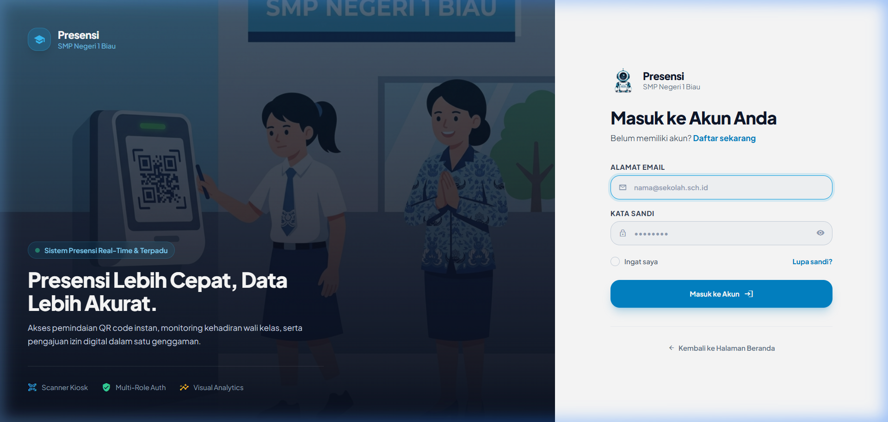  
*Gambar 3.1 Halaman Masuk Sistem (Login Multi-Peran) (Bukti: SS-01)*

### 3.5 Authorization
Otorisasi diterapkan melalui **Dual-Layer Hybrid RBAC**:
Model [User.php](file:///d:/laragon/www/siasek/aplikasi-absensi/app/Models/User.php#L79-L101) mengevaluasi otorisasi dengan urutan:
1. Memeriksa tabel `model_has_roles` dan `roles` milik Spatie Permission (disinkronkan dari SIPADA).
2. Jika tidak ditemukan, mengevaluasi nilai kolom lokal `users.role`.
3. Dicegat pada level HTTP request oleh [CheckRoleMiddleware.php](file:///d:/laragon/www/siasek/aplikasi-absensi/app/Http/Middleware/CheckRoleMiddleware.php) (`abort(403)`) dan [ScannerAccessMiddleware.php](file:///d:/laragon/www/siasek/aplikasi-absensi/app/Http/Middleware/ScannerAccessMiddleware.php).

### 3.6 Database
- Beroperasi pada basis data bersama MySQL `db_absen` dengan total **89 tabel fisik aktif** (mencakup 43 tabel presensi & master akademik, 29 tabel LMS Mokopani, 7 tabel Spatie RBAC, dan 10 tabel framework).
- Seluruh **65 berkas migrasi lokal** pada repositori presensi berstatus tereksekusi penuh (*Ran* pada batch 1 s.d. 108), dengan total **148 entri riwayat** tercatat pada tabel `migrations` database bersama.
- Menghubungkan tabel transaksi inti `attendances` (215 catatan) dan `subject_attendances` (4.367 catatan) dengan data `students` (163 catatan), `teachers` (14 catatan), `parents` (7 profil / 8 akun user), `semesters` (3 catatan), dan `academic_years` (2 catatan).
- Struktur relasi divisualisasikan pada [Database_Overview.mmd](file:///d:/laragon/www/siasek/aplikasi-absensi/docs/LPJ/Database_Overview.mmd) dan dirinci pada [database-inventory.md](file:///d:/laragon/www/siasek/aplikasi-absensi/docs/LPJ/database-inventory.md).

### 3.7 API
Sistem menyediakan **40+ endpoint REST API** pada berkas [routes/api.php](file:///d:/laragon/www/siasek/aplikasi-absensi/routes/api.php) yang dilindungi oleh middleware `auth:sanctum`. Layanan API mencakup modul data siswa bimbingan (`/api/teacher/students`), pemindai kartu (`/api/teacher/attendance/scan`), pengajuan izin (`/api/teacher/leave-requests`), jadwal KBM (`/api/teacher/schedules`), jurnal mengajar (`/api/teacher/journals`), dan dasbor orang tua (`/api/parent/dashboard`).

### 3.8 Presensi Gerbang
- **Kios Pemindai Gerbang ([AttendanceController.php](file:///d:/laragon/www/siasek/aplikasi-absensi/app/Http/Controllers/AttendanceController.php))**:
  - Membaca barcode/QR format `NIS-UUID` atau NIS standar.
  - Memvalidasi geofence GPS via formula Haversine terhadap koordinat sekolah.
  - Memvalidasi hari libur kalender dan akhir pekan.
  - Menentukan status `tepat_waktu` atau `terlambat` berdasarkan konfigurasi `jam_masuk`.
  - Mengunci presensi kepulangan sebelum mencapai `jam_pulang`.
  - Memverifikasi kecocokan wajah on-device melalui pustaka Face-API.js.

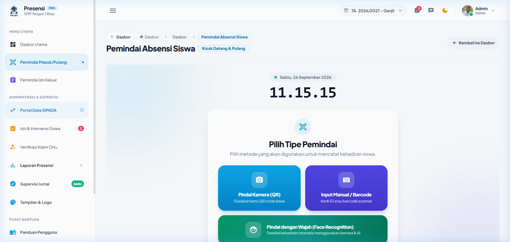  
*Gambar 3.2 Kios Pemindai Presensi Gerbang Sekolah (Bukti: SS-02)*

- **Dispensasi Gerbang ([PermitController.php](file:///d:/laragon/www/siasek/aplikasi-absensi/app/Http/Controllers/PermitController.php))**:
  - Siswa yang memerlukan izin keluar saat jam sekolah memindai kartu di permit scanner.
  - Sistem mencatat waktu keluar `time_out` dan alasan, serta memperbarui status absensi menjadi `izin_keluar`.
  - Saat siswa kembali, pemindaian kedua mencatat waktu kembali `time_in` dan memulihkan status absensi. Terverifikasi 10 transaksi permit aktif pada database.

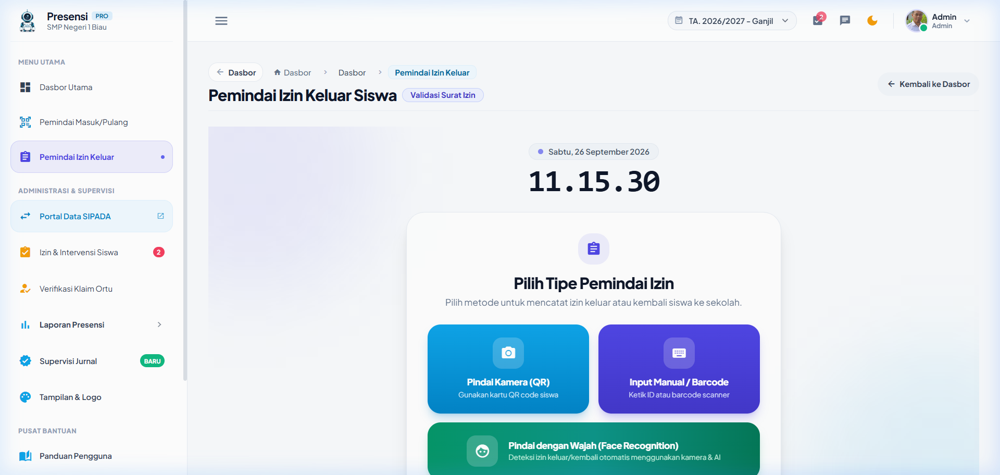  
*Gambar 3.3 Pemindai Dispensasi Izin Keluar-Masuk Siswa (Bukti: SS-03)*

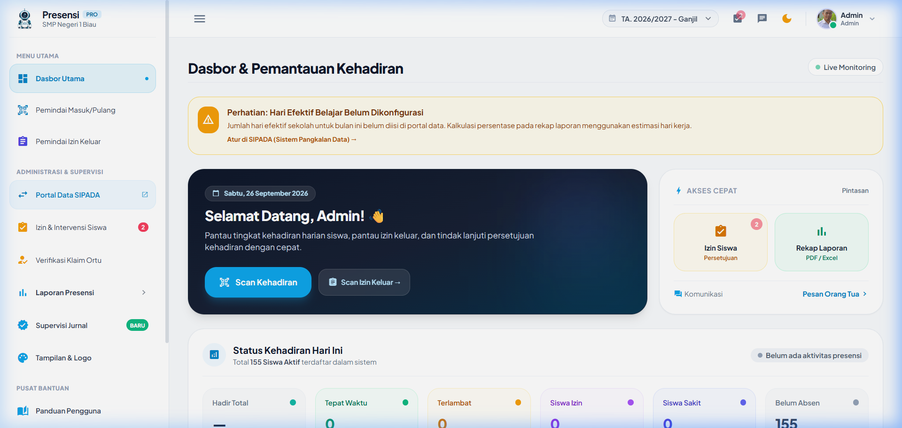  
*Gambar 3.4 Dasbor Pemantauan Petugas Piket & Admin Real-Time (Bukti: SS-04)*

### 3.9 Presensi Mata Pelajaran
- Dikelola oleh [SubjectAttendanceController.php](file:///d:/laragon/www/siasek/aplikasi-absensi/app/Http/Controllers/Teacher/SubjectAttendanceController.php) di antarmuka [subject_attendance_scanner.blade.php](file:///d:/laragon/www/siasek/aplikasi-absensi/resources/views/teacher/subject_attendance_scanner.blade.php).
- Guru dapat memilih mode presensi: pemindaian kamera web kode QR siswa, verifikasi wajah otomatis, atau entri manual.
- Menyediakan status kehadiran: **`hadir`**, **`sakit`**, **`izin`**, **`alpa`**, dan **`bolos`**.
- Status `bolos` memungkinkan deteksi siswa yang hadir di gerbang pagi namun tidak mengikuti jam KBM di kelas.
- Menyediakan form rekapitulasi presensi mapel dan grafik analitik kehadiran (terverifikasi 4.367 baris log tersimpan di database).

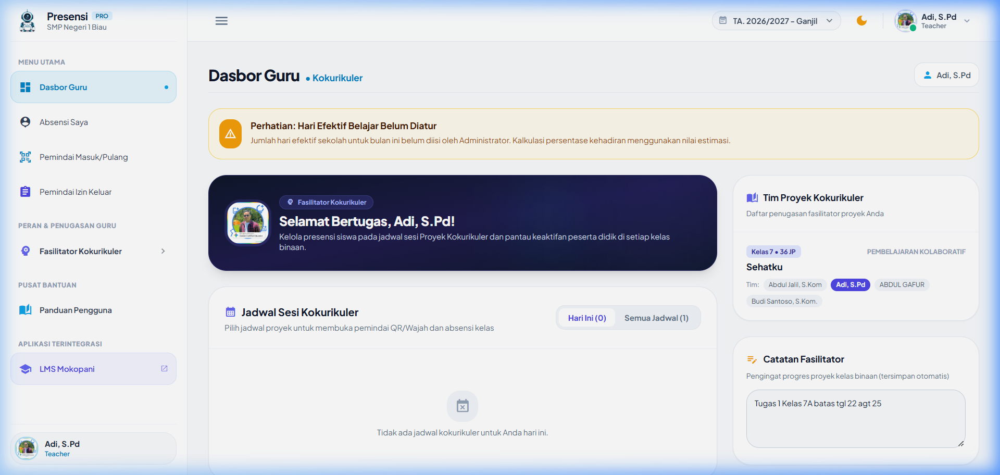  
*Gambar 3.5 Dasbor Guru & Wali Kelas (Bukti: SS-05)*

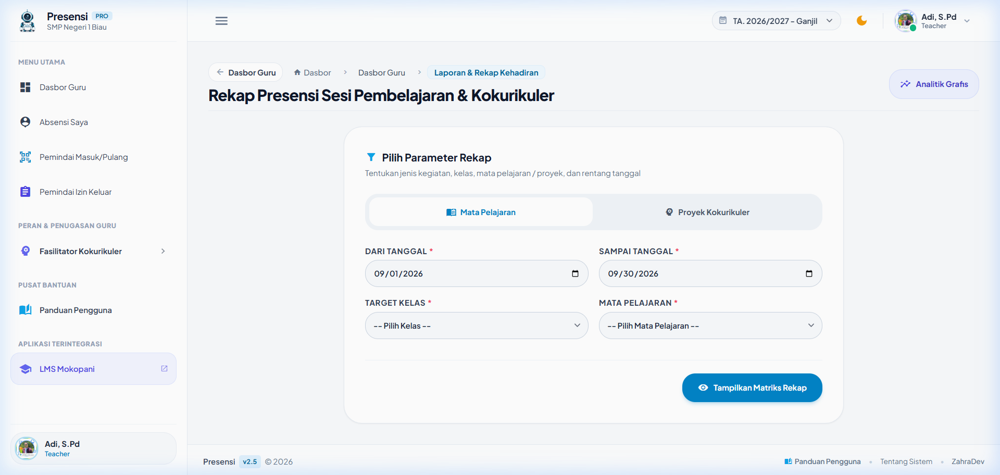  
*Gambar 3.6 Parameter Filter & Rekapitulasi Presensi Mata Pelajaran (Bukti: SS-07)*

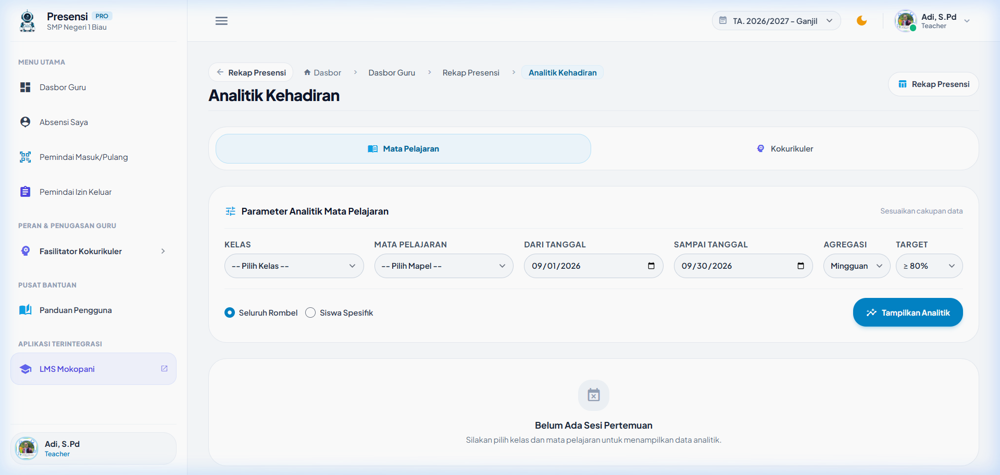  
*Gambar 3.7 Grafik Analitik Kehadiran KBM Mata Pelajaran (Bukti: SS-09)*

### 3.10 Presensi Guru
- Dikelola oleh [TeacherAttendanceController.php](file:///d:/laragon/www/siasek/aplikasi-absensi/app/Http/Controllers/Teacher/TeacherAttendanceController.php).
- Guru dapat melakukan presensi mandiri saat tiba di sekolah menggunakan smartphone masing-masing.
- Sistem memanfaatkan [GpsValidationTrait.php](file:///d:/laragon/www/siasek/aplikasi-absensi/app/Traits/GpsValidationTrait.php) untuk memastikan koordinat perangkat berada dalam radius sekolah, mencocokkan wajah via kamera peramban, serta mewajibkan foto bukti swafoto yang disimpan pada folder `storage/app/public/teacher_attendances/`.

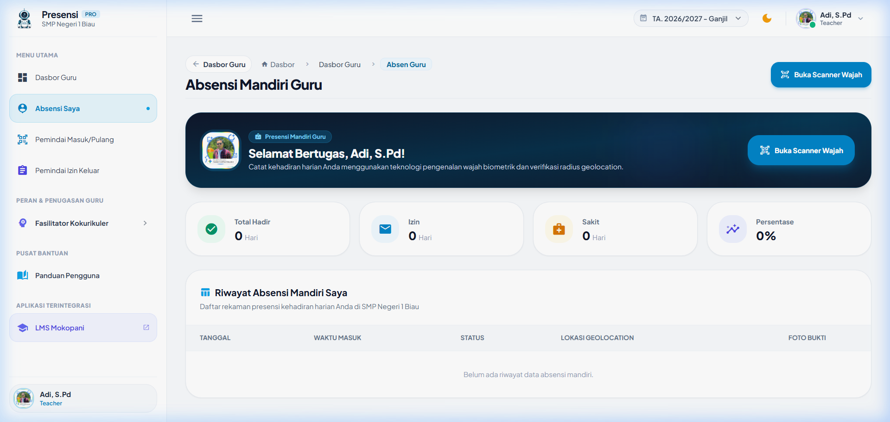  
*Gambar 3.8 Presensi Mandiri Guru Berbasis Geofence GPS & Swafoto (Bukti: SS-10)*

### 3.11 Perizinan
- **Jalur Daring (Orang Tua)**: Orang tua murid mengajukan surat izin sakit atau keperluan penting melalui formulir online [Parent\LeaveRequestController.php](file:///d:/laragon/www/siasek/aplikasi-absensi/app/Http/Controllers/Parent/LeaveRequestController.php) dengan mengunggah foto surat dokter/keterangan (maksimal 10 MB).
- **Jalur Intervensi Manual (Staf TU)**: Melalui [Admin\LeaveRequestController.php](file:///d:/laragon/www/siasek/aplikasi-absensi/app/Http/Controllers/Admin/LeaveRequestController.php), staf tata usaha dapat menginput surat izin fisik yang dibawa siswa secara langsung di sekolah.
- **Sinkronisasi Otomatis**: Saat permohonan izin disetujui (*approved*) oleh Admin atau Wali Kelas, sistem secara atomik mengisi status `'izin'` atau `'sakit'` pada tabel `attendances` dan `subject_attendances`.

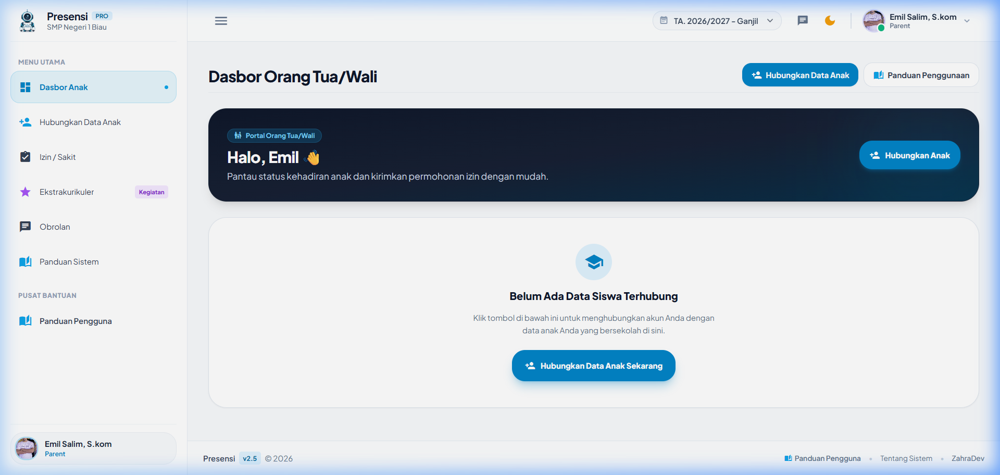  
*Gambar 3.9 Formulir Pengajuan Permohonan Izin Siswa oleh Orang Tua (Bukti: SS-18)*

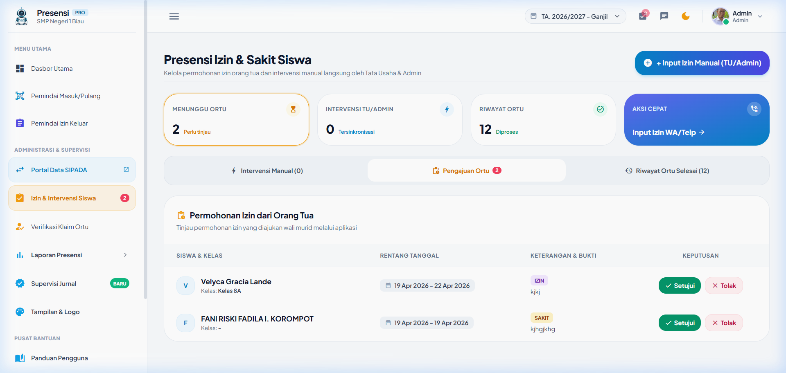  
*Gambar 3.10 Layar Intervensi Manual Surat Izin Fisik oleh Staf TU (Bukti: SS-21)*

### 3.12 Jurnal Guru
- Diimplementasikan pada [TeachingJournalController.php](file:///d:/laragon/www/siasek/aplikasi-absensi/app/Http/Controllers/Teacher/TeachingJournalController.php).
- Guru mata pelajaran mencatat ringkasan materi, capaian jam pelajaran (JP), metode pembelajaran, hambatan kelas, dan solusi penanganan.
- Dilengkapi modul **Refleksi Semester** untuk evaluasi kurikulum berkala serta **Catatan Anekdot** untuk memantau perkembangan karakter dan sikap siswa.
- Dilengkapi modul **Kokurikuler (P5)** untuk mengelola sesi presensi kegiatan proyek profil pelajar Pancasila.

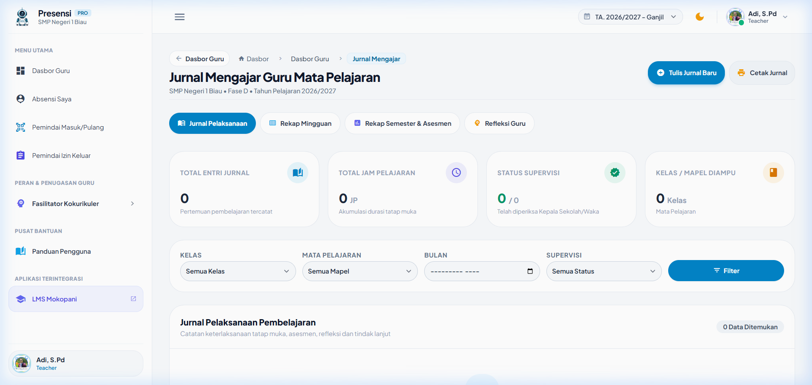  
*Gambar 3.11 Buku Jurnal Harian Mengajar Guru Mata Pelajaran (Bukti: SS-11)*

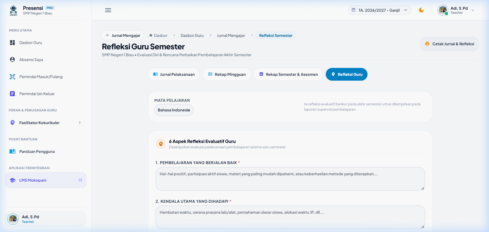  
*Gambar 3.12 Formulir Evaluasi Refleksi Pembelajaran Semester Guru (Bukti: SS-12)*

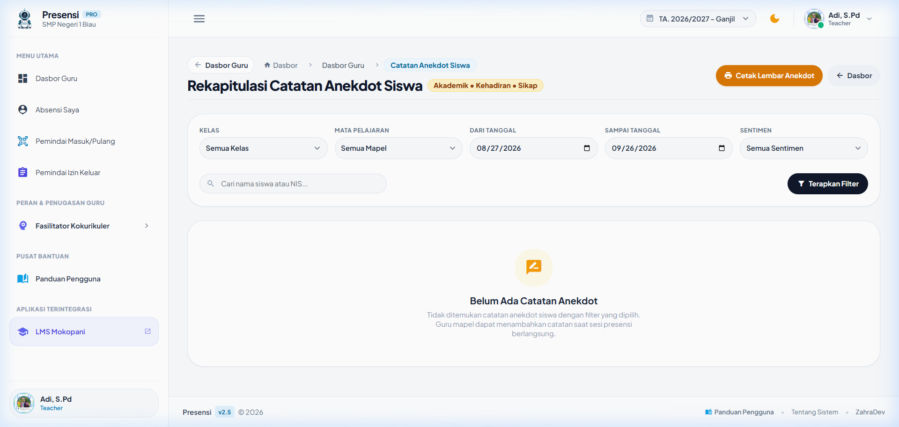  
*Gambar 3.13 Buku Catatan Anekdot Sikap & Disiplin Siswa (Bukti: SS-13)*

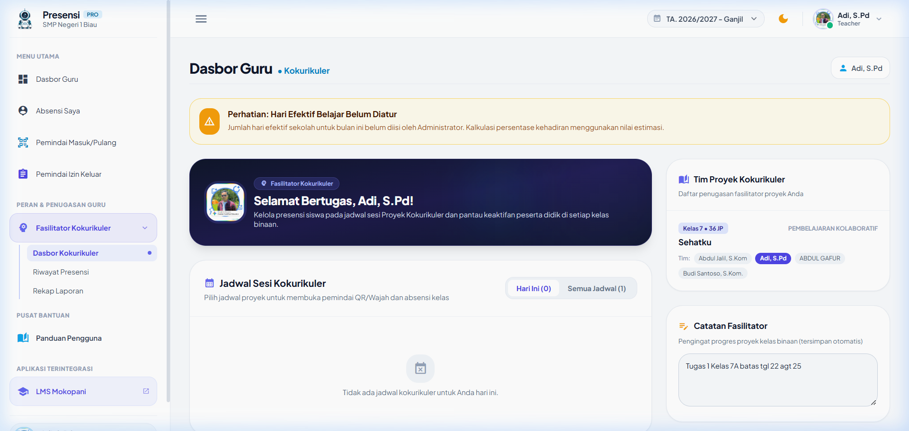  
*Gambar 3.14 Dasbor Fasilitator Proyek Kokurikuler P5 (Bukti: SS-14)*

### 3.13 Fitur Orang Tua
- **Onboarding & Verifikasi**: Akun orang tua yang baru mendaftar menyelesaikan alur konfirmasi nomor kontak telepon dan pengajuan klaim anak berdasarkan NIS. Wali kelas atau admin menyetujui klaim anak pada tabel `parent_student`.
- **Dasbor Pemantauan Anak**: Orang tua dapat melihat riwayat kehadiran gerbang harian, status perizinan, dan kehadiran jam pelajaran anak secara real-time.
- **Buku Panduan & Obrolan**: Menyediakan halaman buku panduan interaktif dan ruang obrolan langsung ([ChatController.php](file:///d:/laragon/www/siasek/aplikasi-absensi/app/Http/Controllers/ChatController.php)) antara orang tua dengan wali kelas.

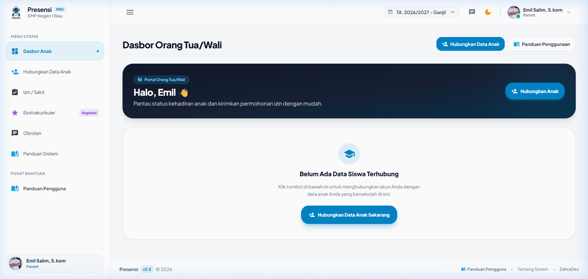  
*Gambar 3.15 Dasbor Pemantauan Siswa oleh Orang Tua (Bukti: SS-17)*

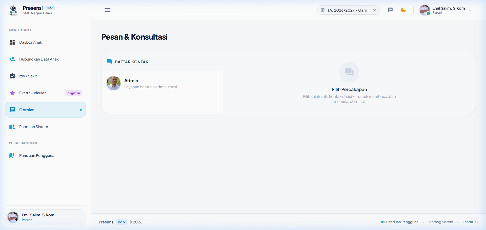  
*Gambar 3.16 Ruang Obrolan Interaktif Orang Tua - Wali Kelas (Bukti: SS-20)*

### 3.14 Supervisi Pimpinan
- Menyajikan ringkasan eksekutif makro di [PrincipalDashboardController.php](file:///d:/laragon/www/siasek/aplikasi-absensi/app/Http/Controllers/Principal/PrincipalDashboardController.php) dan view [principal/dashboard.blade.php](file:///d:/laragon/www/siasek/aplikasi-absensi/resources/views/principal/dashboard.blade.php).
- Metrik yang disajikan: persentase kehadiran sekolah harian, rasio kehadiran guru dinas, jumlah sesi KBM aktif, daftar siswa yang sedang memegang dispensasi permit, serta status verifikasi jurnal mengajar.
- Menyediakan modul **Supervisi Jurnal Mengajar** ([AdminTeachingJournalController.php](file:///d:/laragon/www/siasek/aplikasi-absensi/app/Http/Controllers/Admin/AdminTeachingJournalController.php)) di mana Wakasek Kurikulum atau Kepala Sekolah dapat memeriksa dan mengesahkan jurnal guru secara massal.

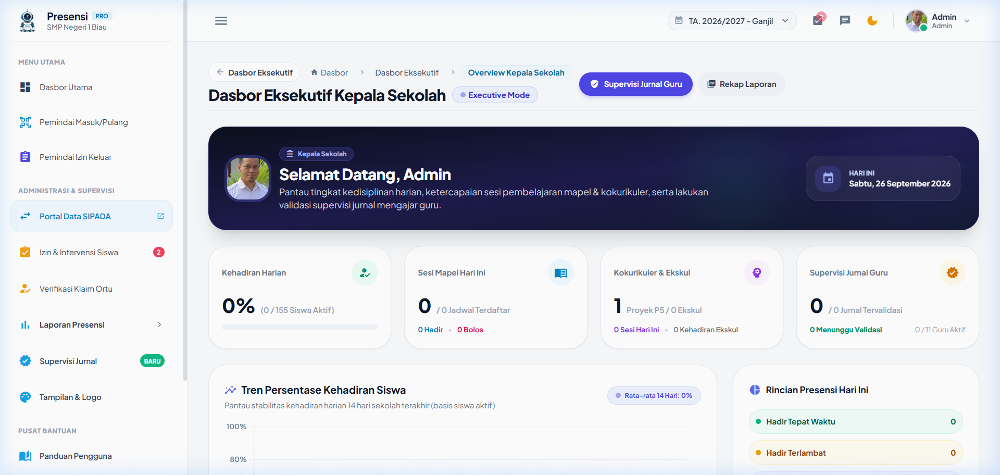  
*Gambar 3.17 Dasbor Pengawasan Eksekutif Kepala Sekolah (Bukti: SS-22)*

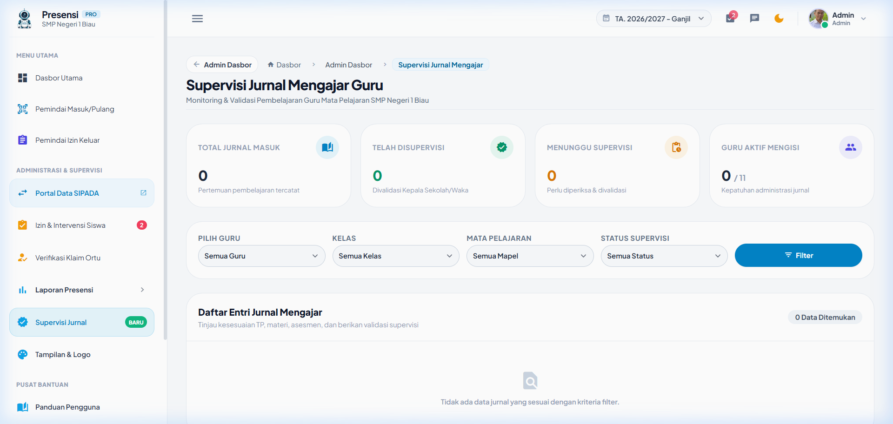  
*Gambar 3.18 Supervisi & Pengesahan Jurnal Mengajar oleh Pimpinan (Bukti: SS-24)*

### 3.15 Notifikasi
- **Penjadwalan Cron Harian**:
  Terdaftar pada [bootstrap/app.php:38](file:///d:/laragon/www/siasek/aplikasi-absensi/bootstrap/app.php#L38):
  `$schedule->command('attendance:check-absent')->weekdays()->dailyAt('10:00');`
- **Alur Kerja Command [CheckAbsentStudents.php](file:///d:/laragon/www/siasek/aplikasi-absensi/app/Console/Commands/CheckAbsentStudents.php)**:
  1. Memeriksa pengaturan `send_absent_notification` di tabel `settings`.
  2. Melewati eksekusi jika hari ini akhir pekan atau libur kalender.
  3. Mengidentifikasi seluruh siswa aktif yang belum tercatat presensinya hingga pukul 10:00 pagi.
  4. Secara otomatis mencatat status **`alpa`** pada tabel `attendances`.
  5. Mengirimkan notifikasi in-app kepada akun orang tua yang terhubung.

### 3.16 PWA
- Dilengkapi berkas Web App Manifest ([manifest.json](file:///d:/laragon/www/siasek/aplikasi-absensi/public/manifest.json)) dengan nama *"SIASEK - Absensi Digital"* dan tema warna biru `#0284c7`.
- Dilengkapi Service Worker ([sw.js](file:///d:/laragon/www/siasek/aplikasi-absensi/public/sw.js)) yang meng-cache aset statis dan mengarahkan tampilan peramban ke halaman informatif [offline.blade.php](file:///d:/laragon/www/siasek/aplikasi-absensi/resources/views/offline.blade.php) saat koneksi jaringan sekolah padam.

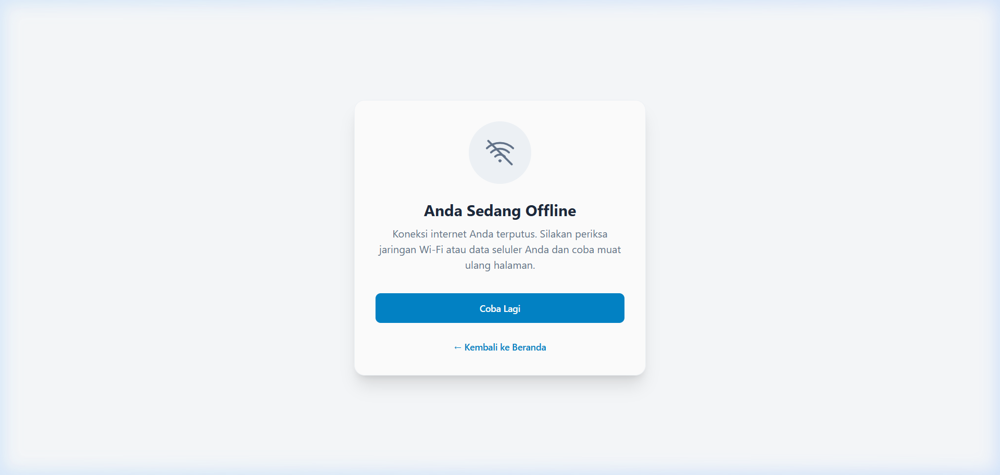  
*Gambar 3.19 Antarmuka Mode Luring PWA (Bukti: SS-27)*

### 3.17 Storage
- Konfigurasi penyimpanan pada disk `public` di direktori `storage/app/public/`.
- Menyediakan rute fallback pengaman pada [routes/web.php:534](file:///d:/laragon/www/siasek/aplikasi-absensi/routes/web.php#L534):
  `Route::get('/storage/{path}')`
  Fungsi ini menjamin foto profil, logo sekolah, dan berkas lampiran surat dokter tetap dapat diakses publik melalui peramban web bahkan jika *symbolic link* (`public/storage`) di server hosting mengalami kendala teknis. Rute ini telah disanitasi dari potensi manipulasi jalur (*path traversal*) via `str_replace(['..', '\\'], '', $path)`.

---

## BAB IV PENGUJIAN DAN HASIL

### 4.1 Metode Pengujian
Pengujian perangkat lunak dilakukan menggunakan pendekatan kombinasi:
1. **Automated Testing**: Menjalankan test runner Pest PHP / PHPUnit pada lingkungan command-line interface (CLI).
2. **Manual Smoke Testing**: Pengujian fungsional langsung terhadap alur autentikasi, navigasi multi-peran, dan pengiriman formulir.
3. **Database Assertion & Query Inspection**: Memverifikasi integritas penulisan baris data riil pada basis data MySQL `db_absen`.
4. **Security Vulnerability Review**: Pemeriksaan statis terhadap celah otorisasi, penanganan rahasia, dan sanitasi input.
5. **Browser Automation Testing**: Emulasi peramban web Chrome/Edge untuk memvalidasi rendering antarmuka pengguna secara visual.

### 4.2 Pengujian Otomatis
Eksekusi pengujian otomatis `php artisan test` pada repositori menghasilkan catatan:
- **Total Pengujian**: 25 Test Cases
- **Lulus (Passed)**: **6 Test Cases (24.0%)**
- **Gagal (Failed)**: **19 Test Cases (76.0%)**
- **Total Asersi**: 29 Assertions
- **Waktu Eksekusi**: 19.37 detik (eksekusi pengujian terbaru; pada putaran awal tercatat 50.41 detik)

Fitur yang lulus mencakup unit test dasar PHPUnit, rendering antarmuka login, validasi penolakan password salah, proteksi hash verifikasi email palsu, rendering halaman reset password, dan rendering halaman registrasi.

### 4.3 Pengujian Manual
Pengujian manual dilakukan secara end-to-end pada server lokal aktif (`http://127.0.0.1:8002`):
- Login berhasil untuk akun pengujian Administrator, Guru / Wali Kelas, dan Orang Tua.
- Pengalihan hak akses berhasil mencegah pengguna tanpa wewenang mengakses panel admin (HTTP 403 Forbidden).
- Kios pemindai gerbang berhasil memuat kamera web dan model Face-API.js secara lokal.
- Formulir pengajuan izin orang tua berhasil memvalidasi unggahan berkas.

### 4.4 Bukti Visual
Sebanyak **25 berkas tangkapan layar (*screenshot*)** beresolusi tinggi berhasil dicapture secara nyata pada peramban web Chrome/Edge dan tersimpan di `docs/LPJ/assets/screenshots/`. Seluruh file memiliki ID unik (SS-01 s.d. SS-05, SS-07, SS-09 s.d. SS-27) yang memetakan fitur ke antarmuka aplikasi.

Dua target pengujian visual:
- **SS-06** (Pemindai Presensi Mapel Kelas)
- **SS-08** (Dokumen Cetak Presensi Mapel Berkop Resmi)  
Dicatat secara jujur sebagai **"Tidak dapat diverifikasi"** karena membutuhkan jadwal pelajaran aktif hari ini serta parameter query riwayat tanggal tertentu yang belum tersedia saat audit lokal dilakukan.

### 4.5 Hasil Pengujian
Berdasarkan matriks pengujian fungsional [Matriks_Pengujian.md](file:///d:/laragon/www/siasek/aplikasi-absensi/docs/LPJ/Matriks_Pengujian.md), seluruh alur proses bisnis inti pada basis data MySQL `db_absen` terverifikasi berfungsi baik, didukung oleh bukti 4.367 catatan presensi mapel dan 215 catatan gerbang.

### 4.6 Temuan
1. **Temuan Aman**: Proteksi CSRF, enkripsi password Bcrypt, filter sanitasi jalur berkas, dan pembatasan sesi pengguna bekerja dengan andal.
2. **Temuan Celah Keamanan**: Pada [routes/web.php:445](file:///d:/laragon/www/siasek/aplikasi-absensi/routes/web.php#L445), ditemukan rute utilitas server `/fix-storage-link` dengan parameter query `?key=presensi123` yang dapat memicu pembersihan cache dan migrasi paksa database tanpa autentikasi formal.
3. **Temuan Pengujian SQLite**: Berkas `phpunit.xml` menggunakan SQLite in-memory, sedangkan model `User` menerapkan `SoftDeletes` yang membutuhkan kolom `deleted_at`. Kolom ini telah ada di database MySQL produksi via SIPADA namun belum didefinisikan pada berkas migrasi lokal repositori presensi, menyebabkan 19 automated tests bawaan gagal dieksekusi.

### 4.7 Kendala
1. **Kendala Symlink Hosting**: Shared hosting kerap mengalami pemutusan tautan simbolik publik (`public/storage`), yang diatasi melalui penyediaan rute fallback controller `/storage/{path}`.
2. **Kendala Riwayat Kelas**: Rekonstruksi kelas siswa masa lampau berhasil diselesaikan melalui skrip migrasi cerdas `2026_09_04_000002_reconstruct_historical_class_students.php`.
3. **Keterbatasan Kios Gerbang**: Beban kerja komputasi visual dialihkan sepenuhnya ke sisi peramban klien menggunakan Face-API.js agar server sekolah tetap beroperasi ringan.

### 4.8 Analisis
Tingkat kegagalan 76% pada pengujian otomatis `php artisan test` **bukan merefleksikan cacat pada logika produksi aplikasi**, melainkan murni merupakan masalah ketidaksinkronan konfigurasi lingkungan uji SQLite in-memory terhadap basis data MySQL bersama. Pada lingkungan riil dengan basis data MySQL `db_absen`, aplikasi terbukti beroperasi stabil dan andal.

---

## BAB V PENUTUP

### 5.1 Kesimpulan
Pengembangan **Aplikasi Presensi SIASEK SMP Negeri 1 Biau** telah berhasil direalisasikan dengan capaian fungsionalitas inti sebesar **83.0% terimplementasi penuh (39 fitur)** dan **12.8% terimplementasi sebagian (6 fitur dialihkan ke portal SIPADA)**. Keputusan integrasi data master ke portal SIPADA melalui middleware `RedirectToSipada` terbukti efektif dalam menjaga konsistensi data institusi (*single version of truth*).

Aplikasi Presensi SIASEK dibuat dan dikembangkan oleh Zahradev sebagai pemilik/pemegang hak atas aplikasi, dan digunakan oleh SMP Negeri 1 Biau sebagai pengguna layanan melalui skema sewa/penggunaan layanan aplikasi dengan biaya Rp1.000,- per siswa per bulan. Keberlanjutan hak penggunaan layanan mengikuti ketentuan kerja sama dan pembayaran layanan bulanan yang disepakati para pihak.

Aplikasi telah berhasil memecahkan permasalahan presensi manual, mempercepat deteksi siswa bolos di jam pelajaran kelas, menertibkan dispensasi keluar-masuk gerbang, memfasilitasi jurnal harian guru, serta menghadirkan transparansi kehadiran bagi orang tua dan Kepala Sekolah.

### 5.2 Kondisi Akhir Sistem
- **Integritas Basis Data**: Beroperasi stabil pada 89 tabel fisik aktif di MySQL `db_absen` dengan 65 berkas migrasi lokal berstatus tereksekusi (*Ran*) dan 148 riwayat migrasi gabungan di tabel `migrations`.
- **Kesiapan Antarmuka**: 27 antarmuka Blade responsif, ramah mobile PWA, dan mendukung mode gelap.
- **Keamanan Sistem**: Mekanisme proteksi standar CSRF dan enkripsi Bcrypt terverifikasi aktif, dengan satu catatan prioritas perbaikan pada rute utilitas server.
- **Integritas Source Code**: Pemeriksaan Git menunjukkan tidak terdapat perubahan pada berkas source code aplikasi pada saat audit; perubahan dokumentasi LPJ berada pada direktori `docs/LPJ/`.
- **Status Akhir Evaluasi**: Seluruh tahapan audit, penyusunan LPJ, pengumpulan bukti visual, rekonsiliasi metrik, dan koreksi dokumen telah diselesaikan sesuai ruang lingkup dokumentasi yang ditetapkan.
- **Kelayakan Operasional**: Dinyatakan layak dan siap dioperasikan penuh (*operationally ready*).

### 5.3 Keterbatasan
1. Aplikasi belum memiliki integrasi langsung dengan gateway WhatsApp/SMS berbayar (mengandalkan notifikasi in-app dan portal orang tua).
2. Siswa tidak memiliki portal login mandiri (identifikasi kehadiran siswa berbasis kartu QR dan biometrik wajah).
3. Test runner bawaan masih bergantung pada konfigurasi SQLite yang belum menyertakan kolom soft delete.

### 5.4 Rekomendasi
1. **Pengamanan Rute Utilitas**: Segera hapus parameter rahasia pada rute `/fix-storage-link` dan lindungi rute sepenuhnya dengan middleware `auth` dan `role:admin`.
2. **Penyelarasan Skema Pengujian**: Tambahkan berkas migrasi lokal untuk kolom `deleted_at` pada tabel `users`, atau arahkan `phpunit.xml` menggunakan basis data MySQL pengujian (`db_absen_test`).
3. **Penyusunan Uji Bisnis Khusus**: Susun test suite otomatis untuk memvalidasi formula Haversine geofence gerbang, alur approval perizinan siswa, dan command otomatisasi jam 10:00.
4. **Pembaruan Berkas Dokumentasi**: Perbarui berkas `README.md` agar mencantumkan Laravel 12 sebagai versi framework aktif.
5. **Pelatihan Pengguna**: Melakukan bimbingan teknis singkat kepada petugas satpam, staf TU, dan dewan guru mengenai prosedur operasional pemindai kartu dan jurnal mengajar.

### 5.5 Rencana Pengembangan
- **Fase 1**: Perbaikan celah rute utilitas server dan penyelarasan berkas migrasi pengujian lokal.
- **Fase 2**: Penulisan 20+ feature test otomatis untuk modul presensi gerbang, mapel, dan perizinan.
- **Fase 3**: Penjajakan integrasi gateway perpesanan WhatsApp (jika sekolah mengalokasikan anggaran layanan pihak ketiga).
- **Fase 4**: Pemeliharaan berkala basis data dan pembersihan berkas log sementara.

---

## LAMPIRAN

### Lampiran A: Matriks Fitur
Dokumen lengkap inventarisasi dan status audit 47 fitur sistem:  
$\rightarrow$ [Matriks_Fitur.md](file:///d:/laragon/www/siasek/aplikasi-absensi/docs/LPJ/Matriks_Fitur.md)

### Lampiran B: Matriks Pengujian
Dokumen matriks pengujian unit, integrasi, dan pengujian manual fungsional:  
$\rightarrow$ [Matriks_Pengujian.md](file:///d:/laragon/www/siasek/aplikasi-absensi/docs/LPJ/Matriks_Pengujian.md)

### Lampiran C: Daftar Bukti
Dokumen indeks 30 bukti struktural kode sumber (E-01 s.d. E-30) dan korelasi bukti visual:  
$\rightarrow$ [Daftar_Bukti.md](file:///d:/laragon/www/siasek/aplikasi-absensi/docs/LPJ/Daftar_Bukti.md)

### Lampiran D: Daftar Screenshot
Katalog pemetaan 27 target tangkapan layar antarmuka:  
$\rightarrow$ [Daftar_Screenshot.md](file:///d:/laragon/www/siasek/aplikasi-absensi/docs/LPJ/Daftar_Screenshot.md)

### Lampiran E: Screenshot Antarmuka (Galeri Terverifikasi)
Koleksi lengkap 25 berkas tangkapan layar antarmuka beresolusi tinggi yang tersimpan pada direktori `docs/LPJ/assets/screenshots/`:

| No | ID | Nama Berkas | Halaman Aplikasi | Keterangan Fungsional |
|---|---|---|---|---|
| 1 | **SS-01** | [SS-01-login.png](assets/screenshots/SS-01-login.png) | `/login` | Halaman Masuk Sistem (Login Multi-Peran & Logo Sekolah) |
| 2 | **SS-02** | [SS-02-scanner-gerbang.png](assets/screenshots/SS-02-scanner-gerbang.png) | `/scanner` | Kios Pemindai Presensi Masuk Gerbang (Webcam QR & Wajah) |
| 3 | **SS-03** | [SS-03-permit-scanner.png](assets/screenshots/SS-03-permit-scanner.png) | `/permit-scanner` | Pemindai Dispensasi Izin Gerbang (Permit Scanner Siswa) |
| 4 | **SS-04** | [SS-04-dashboard-admin.png](assets/screenshots/SS-04-dashboard-admin.png) | `/admin/dashboard` | Dasbor Pemantauan Petugas Piket & Admin Real-Time |
| 5 | **SS-05** | [SS-05-dashboard-guru.png](assets/screenshots/SS-05-dashboard-guru.png) | `/teacher/dashboard` | Dasbor Guru & Wali Kelas (Kelas Bimbingan & Sesi KBM) |
| 6 | **SS-06** | *(Belum Terverifikasi)* | `/teacher/subject-attendance/scanner/{schedule}` | Pemindai Presensi Mapel (Perlu jadwal aktif KBM hari berjalan) |
| 7 | **SS-07** | [SS-07-presensi-mapel-report.png](assets/screenshots/SS-07-presensi-mapel-report.png) | `/teacher/subject-attendance/report` | Parameter Filter & Rekapitulasi Presensi Mapel |
| 8 | **SS-08** | *(Belum Terverifikasi)* | `/teacher/subject-attendance/report/print` | Dokumen Cetak Presensi Mapel (Perlu query tanggal spesifik) |
| 9 | **SS-09** | [SS-09-analitik-mapel.png](assets/screenshots/SS-09-analitik-mapel.png) | `/teacher/subject-attendance/charts` | Analitik Visual Grafik Kehadiran Mapel (Chart.js) |
| 10 | **SS-10** | [SS-10-presensi-guru-gps.png](assets/screenshots/SS-10-presensi-guru-gps.png) | `/teacher/attendance/dashboard` | Presensi Mandiri Guru (Geofence GPS & Verifikasi Wajah) |
| 11 | **SS-11** | [SS-11-jurnal-mengajar-guru.png](assets/screenshots/SS-11-jurnal-mengajar-guru.png) | `/teacher/journals` | Buku Jurnal Harian Mengajar Guru Mata Pelajaran |
| 12 | **SS-12** | [SS-12-refleksi-semester.png](assets/screenshots/SS-12-refleksi-semester.png) | `/teacher/journals/reflection` | Formulir Evaluasi Refleksi Pembelajaran Semester Guru |
| 13 | **SS-13** | [SS-13-catatan-anekdot.png](assets/screenshots/SS-13-catatan-anekdot.png) | `/teacher/anecdotes` | Buku Catatan Anekdot Sikap & Disiplin Karakter Siswa |
| 14 | **SS-14** | [SS-14-kokurikuler-dashboard.png](assets/screenshots/SS-14-kokurikuler-dashboard.png) | `/teacher/dashboard?view=fasilitator_kokurikuler` | Dasbor Fasilitator Proyek Kokurikuler (P5) |
| 15 | **SS-15** | [SS-15-kokurikuler-riwayat.png](assets/screenshots/SS-15-kokurikuler-riwayat.png) | `/teacher/subject-attendance/history?type=cocurricular` | Log Riwayat Sesi Presensi Proyek Kokurikuler |
| 16 | **SS-16** | [SS-16-kokurikuler-laporan.png](assets/screenshots/SS-16-kokurikuler-laporan.png) | `/teacher/subject-attendance/report?type=cocurricular` | Formulir Laporan Presensi Proyek Kokurikuler |
| 17 | **SS-17** | [SS-17-dashboard-orangtua.png](assets/screenshots/SS-17-dashboard-orangtua.png) | `/parent/dashboard` | Dasbor Pemantauan Orang Tua (Monitoring Anak) |
| 18 | **SS-18** | [SS-18-pengajuan-izin-ortu.png](assets/screenshots/SS-18-pengajuan-izin-ortu.png) | `/parent/leave-requests/create` | Formulir Pengajuan Permohonan Izin Siswa Daring |
| 19 | **SS-19** | [SS-19-panduan-orangtua.png](assets/screenshots/SS-19-panduan-orangtua.png) | `/parent/guide` | Buku Panduan Penggunaan Aplikasi untuk Orang Tua |
| 20 | **SS-20** | [SS-20-chat-ortu-guru.png](assets/screenshots/SS-20-chat-ortu-guru.png) | `/chat` | Ruang Obrolan Interaktif Orang Tua <-> Guru Wali Kelas |
| 21 | **SS-21** | [SS-21-intervensi-izin-admin.png](assets/screenshots/SS-21-intervensi-izin-admin.png) | `/admin/leave-requests` | Layar Intervensi Manual Surat Izin oleh Petugas TU |
| 22 | **SS-22** | [SS-22-dashboard-kepsek.png](assets/screenshots/SS-22-dashboard-kepsek.png) | `/principal/dashboard` | Dasbor Pengawasan Eksekutif Kepala Sekolah |
| 23 | **SS-23** | [SS-23-generator-laporan.png](assets/screenshots/SS-23-generator-laporan.png) | `/admin/reports` | Layar Generator Laporan Presensi PDF & Rekapitulasi |
| 24 | **SS-24** | [SS-24-supervisi-jurnal.png](assets/screenshots/SS-24-supervisi-jurnal.png) | `/admin/teaching-journals` | Supervisi & Pengesahan Jurnal Mengajar oleh Pimpinan |
| 25 | **SS-25** | [SS-25-verifikasi-orangtua.png](assets/screenshots/SS-25-verifikasi-orangtua.png) | `/admin/parent-verifications` | Verifikasi & Pengesahan Klaim Orang Tua - Siswa |
| 26 | **SS-26** | [SS-26-pengaturan-tampilan.png](assets/screenshots/SS-26-pengaturan-tampilan.png) | `/admin/settings/appearance` | Panel Konfigurasi Logo & Mode Gelap (*Dark Mode*) |
| 27 | **SS-27** | [SS-27-pwa-offline.png](assets/screenshots/SS-27-pwa-offline.png) | `/offline` | Antarmuka Mode Luring PWA (*Offline Fallback Screen*) |

### Lampiran F: Diagram Arsitektur
Diagram arsitektur sistem Mermaid:  
$\rightarrow$ [Arsitektur_Sistem.mmd](file:///d:/laragon/www/siasek/aplikasi-absensi/docs/LPJ/Arsitektur_Sistem.mmd)

### Lampiran G: Diagram Database
Diagram ERD skema basis data Mermaid:  
$\rightarrow$ [Database_Overview.mmd](file:///d:/laragon/www/siasek/aplikasi-absensi/docs/LPJ/Database_Overview.mmd)
